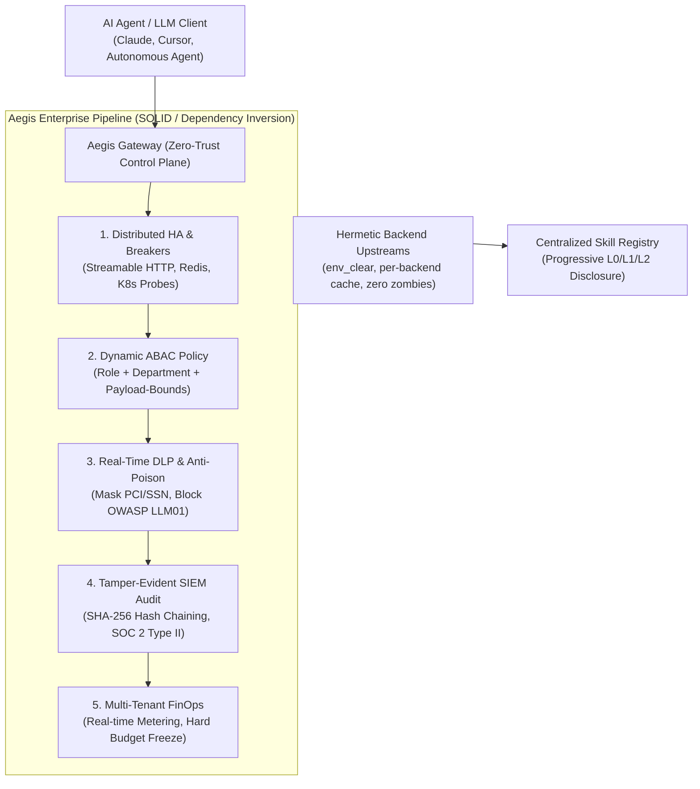

# Aegis Gateway (🛡️)

> **Enterprise Zero-Trust MCP & Skill Control Plane with Distributed State, Granular ABAC, Real-Time DLP, and Tamper-Proof Audit.**

[](LICENSE)
[](https://www.rust-lang.org)
[])-success.svg)](https://github.com/rust-secure-code/safety-dance/)
[-brightgreen.svg)](#verification)
[](#architecture)

---

## Why Aegis Gateway?

Conventional MCP proxies operate as fragile single-process scripts with in-memory state lock-in, coarse permissions, zero data-loss prevention, and zombie process leaks.

**Aegis Gateway** is engineered from day one as a **Cloud-Native, Enterprise-by-Design Control Plane** mediating between AI agents (Claude Desktop, Cursor, Goose, custom LLM agents) and tools.



---

## ⚡ Production CLI Toolset (Developer Experience)

Aegis Gateway comes with a dedicated, ergonomic CLI daemon (`aegis-gateway`) for developer workstations and cloud deployments:

```bash
# 1. Quickstart preflight diagnostics
aegis-gateway doctor

# 2. Scaffold starter topology configuration
aegis-gateway init --output aegis.yaml

# 3. Dynamically manage MCP backend servers
aegis-gateway add postgres --command npx --args -y @modelcontextprotocol/server-postgres
aegis-gateway add github-remote --url https://mcp.internal.acme.com/mcp
aegis-gateway list
aegis-gateway remove postgres

# 4. Validate configuration syntax & upstream availability
aegis-gateway validate --config aegis.yaml

# 5. Start live daemon:
# Run on Streamable HTTP for network clients and Kubernetes (port 39400)
aegis-gateway serve --host 0.0.0.0 --port 39400

# Or run directly on Stdio for Claude Desktop and Cursor
aegis-gateway --stdio
```

---

## Choose Your Journey (DX-Centric Personas)

### ⚡ 1. The Dev Hobbyist (Zero-Config Quickstart < 60s)
*Goal: Connect to Claude Desktop or Cursor immediately with zero external databases.*

1. **Build the CLI**:
   ```bash
   cargo build --release
   ```
2. **Add to Claude Desktop** (`claude_desktop_config.json`):
   ```json
   {
     "mcpServers": {
       "aegis": {
         "command": "/path/to/aegis-gateway/target/release/aegis-gateway",
         "args": ["--stdio"]
       }
     }
   }
   ```
3. *Why it just works*: Default in-memory drivers start instantly. Stdio `stdout` is strictly framed for JSON-RPC 2.0 with zero log pollution (diagnostic logs route exclusively to `stderr`).

---

### 🛠️ 2. The Fullstack Team Lead (Multiplexing & Parity)
*Goal: Multiplex micro-servers under declarative topology with package cache isolation.*

Create `aegis.yaml`:
```yaml
mcpServers:
  filesystem:
    command: "npx"
    args: ["-y", "@modelcontextprotocol/server-filesystem", "/workspace"]
    timeout_secs: 30
  database:
    command: "python3"
    args: ["-m", "mcp_postgres"]
    env:
      PG_HOST: "127.0.0.1"
```
Run with topology:
```bash
aegis-gateway serve --config aegis.yaml --stdio
```
* **Per-Backend Cache Isolation (Issue #622)**: Concurrent `npx` or `uv` spawns receive isolated cache subtrees under `$TMPDIR/aegis-cache/`, preventing torn package trees and `MODULE_NOT_FOUND` timeouts.
* **Server Name Search Discovery (Issue #2317)**: Prompts querying server names (e.g. `postgres`, `filesystem`) instantly surface all member tools even if descriptions omit the server name.
* **Zero Zombie Guarantee**: Subprocesses launch with `kill_on_drop(true)`—never leaving orphaned background processes.

---

### ☸️ 3. The DevOps & Cloud SRE (Kubernetes HA & Production)
*Goal: Multi-pod deployment behind AWS ALB / Ingress with zero-downtime rolling updates.*

* **Streamable HTTP (RFC 2025-03-26)**: Single endpoint `POST /mcp` eliminates dual-endpoint SSE session stickiness failures on Kubernetes load balancers.
* **Protocol Version Header Validation (Issue #540)**: Validates `mcp-protocol-version` requests, refusing unserved revisions with standard HTTP 400 Bad Request.
* **Kubernetes Health Probes**:
  * Liveness: `GET /healthz` -> `{"status":"healthy"}`
  * Readiness: `GET /readyz` -> Distributed state checks.
* **Graceful Drain Coordinator**:
  Holds SIGTERM until active inflight tool requests finish gracefully.

---

### 🔒 4. The CISO & Security Red Team (Zero-Trust & Compliance)
*Goal: Enforce OWASP Top 10 for LLMs, PCI-DSS / HIPAA DLP, and SOC 2 Type II audit integrity.*

* **OWASP LLM08 Hermetic Subprocess Isolation**: Child processes launch with `cmd.env_clear()`, strictly preventing untrusted packages from reading `AWS_SECRET_ACCESS_KEY` or DB secrets.
* **Dynamic Payload ABAC (Issue #555)**:
  Blocks destructive SQL or unauthorized fund transfers even if the caller holds a developer role.
* **Inline PCI-DSS DLP**: Masks credit card PANs inline (`[REDACTED_CREDIT_CARD]`) before tool outputs reach LLM context windows.
* **Tamper-Evident SIEM Audit**: Consecutive SHA-256 hash chaining ensures cryptographic non-repudiation:
  ```bash
  aegis-gateway audit --output soc2-audit-report.json
  ```

---

### 📈 5. Enterprise Architect & FinOps (Runaway Loop Freezes)
*Goal: Prevent autonomous agent loops from draining corporate budgets.*

* **Multi-Tenant Budget Metering**: Partitioned tracking by `TenantId` and department.
* **Automated Hard Freeze**: Once threshold is breached, subsequent invocations are rejected immediately.
* **Distributed Circuit Breakers**: Tripped backends fast-fail in microseconds, preventing cascading pool exhaustion.

---

## 🧪 Graduated Testing Framework & Parity Suite

Aegis Gateway enforces real-world reliability through a progressive 6-Tier E2E matrix and legacy parity verification:

```bash
cargo test --test e2e_tier1_hobbyist_quickstart      # Tier 1: Zero-Config Golden Path
cargo test --test e2e_tier2_clumsy_dev_negative      # Tier 2: Boundary Misuse & Broken JSON
cargo test --test e2e_tier3_team_multiplexing        # Tier 3: Subprocess Orchestration & Anti-Zombie
cargo test --test e2e_tier4_enterprise_ha_production # Tier 4: K8s Probes & Graceful Drain
cargo test --test e2e_tier5_ciso_adversarial_security# Tier 5: OWASP LLM, DLP, & SIEM Hash Chains
cargo test --test e2e_tier6_sre_chaos_resilience     # Tier 6: Fault Injection & FinOps Hard Freeze
cargo test --test phase9_cli_daemon_test             # Tier 7: Production CLI Daemon & Server
cargo test --test phase9_legacy_parity_test          # Tier 8: Legacy Gaps (Search, Cache, Split, Headers)
```

---

## Enterprise Roadmap

Full specs available in [`docs/roadmap/`](docs/roadmap/):

| Phase | Milestone | Standard / Focus | Status |
| :--- | :--- | :--- | :--- |
| **Phase 1** | Distributed Foundation | Redis Cluster, Rate Limiter, Circuit Breaker | `Completed` |
| **Phase 2** | Zero-Trust IAM & ABAC | OIDC / JWT, OPA Dynamic Payload Constraints | `Completed` |
| **Phase 3** | Real-Time DLP | Sub-ms Regex + Presidio PHI/PII Masking | `Completed` |
| **Phase 4** | Tamper-Evident SIEM | SHA-256 Hash Chained Audit, OpenTelemetry | `Completed` |
| **Phase 5** | FinOps & Multi-Tenancy | Tenant Quotas, Soft Alerts, Hard Freeze | `Completed` |
| **Phase 6** | Centralized Skill OS | GitOps Hot-Reload, Semantic Vector RAG | `Completed` |
| **Phase 7** | MCP Wire Transports | JSON-RPC 2.0, Clean Stdio, Streamable HTTP | `Completed` |
| **Phase 8** | Backend Multiplexing | Hermetic Sandboxing, Config Loader | `Completed` |
| **Phase 9** | Production CLI Daemon | CLI Subcommands (`serve`, `add`, `list`), Legacy Parity | `Completed` |
| **Phase 10**| Graduated E2E Testing | 6-Tier Persona Validation Matrix | `Completed` |

---

## Verification & Auditing

Run the comprehensive enterprise governance check:
```bash
bash scripts/governance-check.sh
```

Run all 62 unit, integration, and E2E test cases:
```bash
cargo test
```

Check architectural invariants (SOLID & <= 350 lines per file):
```bash
find src tests -type f -name "*.rs" -exec wc -l {} + | sort -n
```

---

## License

This project is licensed under the permissive **[MIT License](LICENSE)**. Free for commercial enterprise adoption without source-available or non-commercial restrictions.
