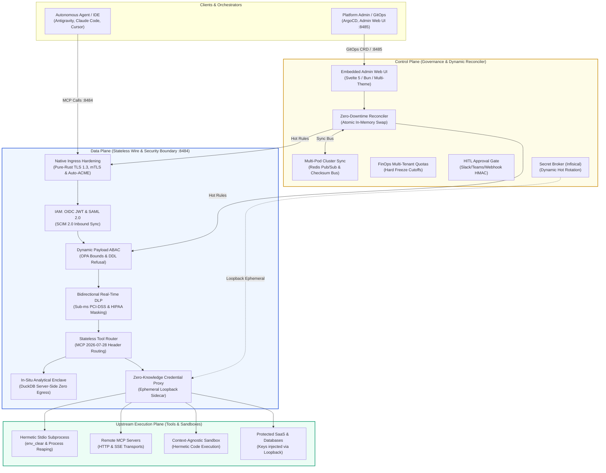

# Aegis Gateway (🛡️)

> **Enterprise-Grade Zero-Trust MCP Control Plane & Resilient Data Gateway**  
> *Cloud-Native, High-Availability Reverse Proxy for Model Context Protocol (MCP) and Autonomous AI Agents.*

[](LICENSE)
[](https://www.rust-lang.org)
[])-success.svg)](https://github.com/rust-secure-code/safety-dance/)
[-brightgreen.svg)](#-verification--auditing)
[](#-ciso-security--compliance-mapping)
[](#-enterprise-architect-day-2-operations)

---

## Table of Contents

- [Overview](#-overview)
- [Key Concepts](#-key-concepts)
- [Architecture](#-architecture)
- [Enterprise Comparison Matrix](#-enterprise-comparison-matrix)
- [CISO Security & Compliance Mapping](#-ciso-security--compliance-mapping)
- [Enterprise Architect Day-2 Operations](#-enterprise-architect-day-2-operations)
- [Production CLI & Quickstart](#-production-cli--quickstart)
- [Features by Persona](#-features-by-persona)
- [Verification & Auditing](#-verification--auditing)
- [License](#-license)

---

## 📖 Overview

**Aegis Gateway** is a high-performance, pure-Rust reverse proxy, security firewall, and dynamic control plane for [Model Context Protocol (MCP)](https://modelcontextprotocol.io) servers. 

First-generation MCP gateways operate as fragile, single-process hobbyist wrappers with in-memory state lock-in, non-commercial license traps, zero data loss prevention, and service-crashing restarts. Aegis Gateway solves this enterprise readiness deficit by providing:

1. **High-Performance Data Plane**: Sub-millisecond stateless request routing natively supporting modern **MCP `2026-07-28`** and legacy `2024-11-05` (Dual-Stack Adaptive Negotiation), hermetic Stdio processes, Server-Sent Events (SSE), and Streamable HTTP endpoints without session stickiness failures.
2. **Zero-Downtime Dynamic Control Plane**: Reconciles backend servers, policy tiers (`dev`/`hybrid`/`strict`), and token limits at runtime via Kubernetes CRDs and Admin APIs—without ever restarting active streaming pods.
3. **Zero-Trust Security & DLP Boundary**: Inline bidirectional sanitization for PCI-DSS/HIPAA, hermetic code execution sandboxes, and zero-knowledge credential brokerage (LLMs never touch raw API keys).
4. **Auditability & Multi-Tenant FinOps**: Tamper-evident SHA-256 hash-chained audit trails for SOC 2 Type II compliance and hard budget freezes to halt runaway autonomous agent loops.

---

## 🔑 Key Concepts

- **Data Plane (Stateless Wire Routing)**: Evaluates per-request authentication, dynamic payload ABAC, and DLP inspection in real time, routing `/mcp` tool execution requests to ready backend instances with zero transport-session affinity.
- **Dual-Stack Adaptive MCP Negotiation**: First-class support for modern **MCP `2026-07-28`** stateless routing (`Mcp-Method`/`Mcp-Name` HTTP headers, Anti-Desync validation, `ttlMs` cache hints) alongside legacy `2024-11-05` clients with zero breaking changes.
- **Dynamic Control Plane (Zero-Restart Reconciler)**: Runtime engine inspired by the Envoy xDS architecture. Uses atomic in-memory state swapping (`RwLock` / RCU-style) to add/remove tools and update policy tiers without dropping active agent streams.
- **Zero-Knowledge Credential Broker**: Bridges secrets (OAuth tokens, API keys) via in-memory ephemeral loopback proxies. Downstream AI agents interact with external APIs without ever seeing or storing the plaintext credentials.
- **In-Situ Analytical Enclave**: A server-side data clean room (DuckDB / Polars) that runs queries on large datasets (100MB+ Parquet/ZIP) directly in memory, returning lightweight aggregated summaries (<1KB) to prevent data exfiltration (>99.9% egress reduction).
- **Human-in-the-Loop (HITL) Gate**: Detects high-risk or destructive actions (table drops, IAM modifications, public sharing) and suspends the task, dispatching interactive approval cards to Slack or Microsoft Teams with tamper-proof HMAC verification.
- **Distributed Cluster Sync**: A multi-node synchronization bus (Redis / NATS / Channel) that broadcasts runtime configuration updates across Kubernetes pod replicas using SHA-256 rolling checksums to prevent split-brain drift.

---

## 🏛️ Architecture



---

## ⚖️ Enterprise Comparison Matrix

| Capability / Risk Vector | Legacy MCP Gateways (`MikkoParkkola`) | Docker MCP Gateway | Microsoft MCP Gateway | **Aegis Gateway (Enterprise)** |
| :--- | :--- | :--- | :--- | :--- |
| **Open Source License** | ⚠️ **PolyForm Noncommercial** (Commercial Legal Risk) | Apache 2.0 | MIT | ✅ **MIT Permissive** (Zero Legal Risk) |
| **High-Availability State** | ❌ In-memory only (Single process crash) | ❌ In-memory only | ⚠️ Single-replica preview | ✅ **Distributed Redis Cluster & Memory Fallback** |
| **Runtime Control Plane** | ❌ Hard process restart required | ❌ Hard process restart required | ⚠️ Redeploy pod required | ✅ **Zero-Downtime Atomic Hot-Reload (Envoy xDS)** |
| **Credential Protection** | ❌ Raw API keys passed to subprocesses | ❌ Plaintext `.env` files | ❌ Plaintext container env | ✅ **Zero-Knowledge Loopback Proxy (LLM never sees key)** |
| **Data Loss Prevention (DLP)**| ❌ None (PII/PCI leaks to context window) | ❌ None | ❌ None | ✅ **Bidirectional Sub-ms PCI-DSS / HIPAA Masking** |
| **Data Exfiltration Defense**| ❌ Unrestricted raw file download | ❌ Unrestricted download | ❌ Unrestricted download | ✅ **In-Situ Analytical Enclave (DuckDB, >99.9% reduction)** |
| **Human-in-the-Loop (HITL)** | ❌ No suspension or approval gates | ❌ None | ❌ None | ✅ **Multi-Channel Approval (Slack/Teams) with HMAC** |
| **Ingress TLS & mTLS** | ❌ Reverse proxy mandatory | ❌ Reverse proxy mandatory | ⚠️ Azure Front Door lock-in | ✅ **Native Pure-Rust TLS 1.3, mTLS & Auto-ACME** |
| **Identity Federation** | ❌ Local file token only | ❌ Environment vars | ⚠️ Entra ID lock-in only | ✅ **Universal OIDC, SAML 2.0 & SCIM 2.0 Ingestion** |
| **Admin Control Interface** | ❌ None (CLI only) | ❌ Docker Compose only | ⚠️ Azure Portal SaaS | ✅ **Embedded Svelte 5 Web UI (:8485, Multi-Theme, Anti-Slop)** |
| **MCP Protocol Standard** | ⚠️ Legacy `2024-11-05` only | ⚠️ Legacy `2024-11-05` only | ⚠️ Breaking cut (drops `2024-11-05`) | ✅ **Dual-Stack Adaptive (`2026-07-28` + `2024-11-05`)** |
| **FinOps Cost Governance** | ❌ Unbounded loops drain API credits | ❌ None | ❌ None | ✅ **Real-Time Token Quotas & Automated Hard Freeze** |
| **Compliance Audit Trail** | ❌ Raw stdout logging | ❌ Docker container logs | ❌ Basic telemetry | ✅ **Cryptographic SHA-256 Hash Chained SIEM Audit** |
| **Memory Safety & Speed** | ⚠️ Unconstrained Rust / Go | ⚠️ Go runtime | ⚠️ C# / .NET runtime | ✅ **Pure-Rust `#![deny(unsafe_code)]` (<30MB RAM)** |

---

## 🛡️ CISO Security & Compliance Mapping

Aegis Gateway directly addresses the **OWASP Top 10 for LLM & Agentic Applications** and aligns with **SOC 2 Type II**, **ISO 27001**, **HIPAA**, and **GDPR/UU PDP Article 32**:

| OWASP Risk Category | Vulnerability Scenario | Aegis Gateway Architectural Defense |
| :--- | :--- | :--- |
| **LLM01: Prompt Injection** | Malicious instructions injected via tool descriptions or scraped web data. | `PoisonScanner` scans tool outputs; `ThreatEvidenceEnricher` inspects URLs before execution. |
| **LLM02: Sensitive Data Disclosure** | Credit card numbers, SSNs, or API tokens leak into LLM prompts. | `DlpPipeline` inspects inbound/outbound payloads with sub-ms regex & Presidio masking. |
| **LLM05: Improper Output Handling** | Executable scripts disguised as innocent files (e.g. `.pdf`). | `LocalFsStreamingVault` performs deep magic-byte inspection rejecting disguised binaries. |
| **LLM06: Excessive Agency** | Autonomous agent attempts destructive operations (`DROP TABLE`, `rm -rf`). | `ActionApprovalGate` classifies risk tier and forces HITL managerial approval. |
| **LLM08: Vector / Environment Escape** | Subprocesses accessing host environment secrets or network probes. | Hermetic execution with `env_clear()`, loopback proxying, and SSRF CIDR firewalls. |
| **Unbounded Consumption** | Broken agent loop issuing thousands of queries draining budget. | `QuotaEngine` meters token/cost usage per tenant with automated hard freeze cutoffs. |

---

## ☸️ Enterprise Architect Day-2 Operations

### 1. Zero-Downtime Dynamic Control Plane
In enterprise environments, restarting the gateway is an anti-pattern. Aegis Gateway enforces **zero-restart dynamic reconfiguration**:
* **Live Tool Registration**: Add, update, or deregister backend MCP servers via REST API or Kubernetes CRD without dropping active agent streams.
* **Instant Policy Switching**: Transition tenants dynamically between `dev`, `hybrid`, and `strict` policy tiers in 0ms.
* **Secret Hot-Rotation**: Ingest rotated secrets from Infisical without restarting listener ports.

### 2. Declarative Kubernetes CRD Operator (GitOps Native)
Manage your entire AI tool infrastructure declaratively via ArgoCD or Flux using first-class Custom Resources:
```yaml
apiVersion: aegis.enterprise.io/v1alpha1
kind: AegisBackend
metadata:
  name: gdrive-connector
  namespace: aegis-production
spec:
  transport: sse
  endpoint_or_cmd: https://mcp-gdrive.internal.svc:8484/sse
  replicas: 3
  enabled: true
---
apiVersion: aegis.enterprise.io/v1alpha1
kind: AegisPolicy
metadata:
  name: strict-banking-policy
  namespace: aegis-production
spec:
  tier: strict
  rateLimitRps: 100
  circuitBreakerThreshold: 5
  dlpEnabled: true
```

### 3. Distributed Cluster Sync & Pub/Sub Bus
When scaling across dozens of pods in Kubernetes, configuration updates on any single pod are instantly published over the Redis/NATS Pub/Sub bus. Peer pods validate message signatures and apply atomic in-memory updates, ensuring **zero configuration drift**.

---

## ⚡ Production CLI & Quickstart

### 1. Developer Workstation (60-Second Quickstart)
Run Aegis locally with zero external dependencies:
```bash
# Run on Stdio for Claude Desktop, Cursor, or Antigravity IDE
aegis-gateway --stdio

# Or run as a local HTTP daemon with built-in doctor diagnostics
aegis-gateway doctor
aegis-gateway serve --host 127.0.0.1 --port 8484
```

### 2. Connect Your AI Client (`claude_desktop_config.json`)
```json
{
  "mcpServers": {
    "aegis": {
      "command": "/usr/local/bin/aegis-gateway",
      "args": ["--stdio"]
    }
  }
}
```

### 3. Production Kubernetes Deployment
```yaml
apiVersion: apps/v1
kind: Deployment
metadata:
  name: aegis-gateway
  namespace: aegis-system
spec:
  replicas: 3
  template:
    spec:
      containers:
      - name: gateway
        image: ghcr.io/aegis-gateway/aegis-gateway:latest
        ports:
        - containerPort: 8484
        livenessProbe:
          httpGet:
            path: /healthz
            port: 8484
        readinessProbe:
          httpGet:
            path: /readyz
            port: 8484
        env:
        - name: AEGIS_STATE_BACKEND
          value: "redis://redis-cluster.aegis-system:6379"
        - name: AEGIS_POLICY_TIER
          value: "hybrid"
```

---

## 👥 Features by Persona

### 👨‍💻 Developer & Data Scientist
* Connect local and remote MCP tools instantly.
* Query massive parquet datasets in Google Drive via in-situ DuckDB analytics without waiting for gigabyte downloads.

### 🛡️ Security Engineer & CISO
* Verify that LLM models never hold direct cloud credentials.
* Monitor real-time DLP redaction and export cryptographic SOC 2 audit chains:
  ```bash
  aegis-gateway audit --output soc2-audit-report.json
  ```

### ☸️ Platform Architect & SRE
* Scale horizontally with Redis cluster state backend.
* Enforce GitOps declarative control via Kubernetes CRDs.
* Maintain 99.999% uptime with zero-restart hot-reloads and graceful draining (`DrainCoordinator`).

---

## 🧪 Verification & Auditing

Aegis Gateway enforces software craftsmanship through continuous automated governance gates:

```bash
# 1. Ultra-fast parallel test execution via cargo-nextest (~6 seconds across all 145 tests)
cargo nextest run

# Or standard Cargo runner
cargo test

# 2. Verify Zero-Mock production integrity
bash scripts/audit_mock_detection.sh

# 3. Verify Zero-Downtime Dynamic Control Plane invariants
bash .agents/skills/zero-downtime-control-plane-auditor/scripts/audit_zero_downtime.sh

# 4. Run the full unified enterprise governance battery
bash scripts/governance-check.sh
```

Every single line of production code adheres strictly to:
* **Interface-First Architecture** (`src/core/`)
* **Maximum 350 Lines per File** (`wc -l <= 350`)
* **Zero Unsafe Code** (`#![deny(unsafe_code)]`)
* **Zero Mocks in Production Drivers**

---

## 📄 License

This project is licensed under the permissive **[MIT License](LICENSE)**. Free for commercial enterprise adoption, modification, and deployment without proprietary or non-commercial restrictions.
