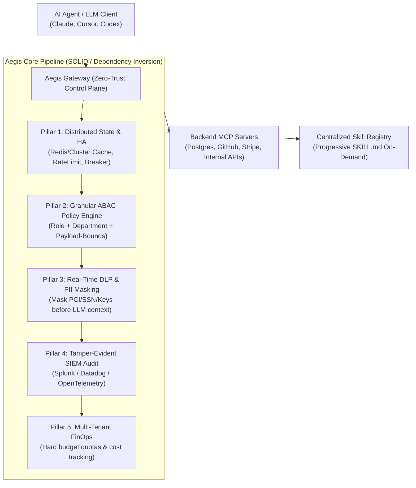

# Aegis Gateway (🛡️)

> **Enterprise Zero-Trust MCP & Skill Gateway with Distributed State, Granular ABAC, Real-Time DLP, and Tamper-Proof Audit.**

[](LICENSE)
[](https://www.rust-lang.org)
[](https://github.com/rust-secure-code/safety-dance/)
[](#architecture)

---

## Why Aegis Gateway?

While conventional MCP proxies operate as single-process binaries with in-memory state and permissive routing, **Aegis Gateway** is engineered from day one around **SOLID design principles** and **Enterprise Zero-Trust requirements**.

It acts as a secure, distributed control plane mediating between AI agents (Claude, Cursor, Codex, custom LLM agents) and enterprise tools/skills.



---

## The 6 Enterprise Pillars

1. **Distributed State & Clustering (HA)**: Pluggable distributed cache, token-bucket rate limiting, and circuit breaker traits. No single-process in-memory lock-in. Ready for Kubernetes stateless replicas.
2. **Zero-Trust IAM & Granular ABAC**: Attribute-Based Access Control inspecting not only caller roles, but dynamic payload arguments (e.g., maximum dollar amount thresholds on financial tools).
3. **Real-Time Data Loss Prevention (DLP)**: Automatic inline scanning and redaction of credit cards (PCI-DSS), Social Security Numbers / NIK (GDPR/PII), and API secrets before they enter the model's context.
4. **Tamper-Evident SIEM Audit**: Structured audit events streamed to enterprise logging backends with SHA-256 payload integrity hashing.
5. **Multi-Tenant FinOps**: Department-level budget enforcement and automatic hard freezes upon quota exhaustion.
6. **Pure MIT License**: Zero proprietary or non-commercial source-available traps (no PolyForm restrictions). Free for enterprise adoption.

---

## Built-In Agent Governance Skills

This repository includes autonomous agent skills located in [`.agents/skills/`](.agents/skills/) to ensure that any AI coding assistant modifying the codebase strictly adheres to enterprise and architectural standards:

| Skill | Purpose |
| :--- | :--- |
| **`enterprise-readiness-auditor`** | Audits the 6 enterprise pillars and verifies zero regression. |
| **`mcp-protocol-governor`** | Validates JSON-RPC 2.0 conformance, Progressive Disclosure (L0/L1/L2), and anti-poisoning defenses. |
| **`solid-code-reviewer`** | Verifies Single Responsibility, Interface Segregation, and `#![deny(unsafe_code)]`. |

---

---

## Enterprise Roadmap

Aegis Gateway follows an enterprise multi-phase roadmap detailed in [`docs/roadmap/`](docs/roadmap/):

- **[Master Overview](docs/roadmap/00_ROADMAP_OVERVIEW.md)**: Executive summary, phase ledger, and compliance standards.
- **[Phase 1: Distributed State & HA](docs/roadmap/01_PHASE_1_DISTRIBUTED_FOUNDATION.md)**: Redis/Cluster backend, distributed locks, and K8s HA.
- **[Phase 2: Zero-Trust IAM & ABAC](docs/roadmap/02_PHASE_2_ZERO_TRUST_IAM_ABAC.md)**: OIDC/SAML federation and payload-level policy evaluation.
- **[Phase 3: Real-Time DLP & AI Guardrails](docs/roadmap/03_PHASE_3_REALTIME_DLP_GUARDRAILS.md)**: In-line PII/PCI masking and anti-poisoning defenses.
- **[Phase 4: Tamper-Evident SIEM Audit](docs/roadmap/04_PHASE_4_IMMUTABLE_AUDIT_SIEM.md)**: SHA-256 hash chaining and OTel/Splunk export.
- **[Phase 5: FinOps & Multi-Tenancy](docs/roadmap/05_PHASE_5_FINOPS_MULTI_TENANCY.md)**: Departmental chargeback and hard budget cutoffs.
- **[Phase 6: Centralized Skill OS](docs/roadmap/06_PHASE_6_CENTRALIZED_SKILL_OS.md)**: Progressive disclosure and GitOps skill catalog.

---

## Quick Start & Verification

### 1. Run the Unified Enterprise Governance Suite
```bash
bash scripts/governance-check.sh
```

### 2. Run the Dedicated Compliance Auditor Binary
```bash
cargo run --bin aegis-audit
```

### 3. Run Integration Tests
```bash
cargo test
```

### 4. Start Aegis Gateway
```bash
cargo run --bin aegis-gateway
```

