# Aegis Gateway: Master Multi-Phase Enterprise Roadmap

> **Status**: Active Living Roadmap  
> **Target Standard**: SOC 2 Type II, ISO 27001, HIPAA, PCI-DSS, NIST AI RMF, OWASP Agentic AI Top 10  
> **License**: MIT (Permissive)  
> **Architecture Core**: SOLID, Zero Unsafe Code, Dependency Inversion

---
## Executive Summary

`Aegis Gateway` is engineered to solve the fundamental enterprise readiness deficit present in first-generation MCP gateways. First-generation proxies suffer from in-memory state lock-in, coarse role bits, zero data-loss prevention, and non-commercial license traps.

Aegis Gateway establishes a **Cloud-Native, Enterprise-by-Design Control Plane** mediating all AI agent tool and skill invocations.

```mermaid
flowchart LR
    P1["Phase 1:<br/>Distributed State"] --> P2["Phase 2:<br/>Zero-Trust IAM"]
    P2 --> P3["Phase 3:<br/>DLP Guardrails"]
    P3 --> P4["Phase 4:<br/>SIEM Audit"]
    P4 --> P5["Phase 5:<br/>FinOps Quotas"]
    P5 --> P6["Phase 6:<br/>Skill OS"]
    P6 --> P7["Phase 7:<br/>MCP Wire"]
    P7 --> P8["Phase 8:<br/>Multiplexing"]
    P8 --> P9["Phase 9:<br/>CLI Daemon & Parity"]
    P9 --> P10["Phase 10:<br/>Graduated E2E"]
```

| **Phase 12**| **Egress, Refusal & Attestation** | SSRF Guardrails, Refusal Audit Integrity & Tool Outcome Attestation | `Completed` | [`12_PHASE_12_EGRESS_GUARDRAILS_REFUSAL_INTEGRITY_AND_OUTCOME_ATTESTATION.md`](./12_PHASE_12_EGRESS_GUARDRAILS_REFUSAL_INTEGRITY_AND_OUTCOME_ATTESTATION.md) |
| **Phase 13**| **Stream Buffers, OAuth & Reaping** | Reusable Stream Buffers, OAuth Resource Metadata & Process Reaping | `Completed` | [`13_PHASE_13_STREAM_BUFFER_REUSE_OAUTH_RESOURCE_METADATA_AND_PROCESS_REAPER.md`](./13_PHASE_13_STREAM_BUFFER_REUSE_OAUTH_RESOURCE_METADATA_AND_PROCESS_REAPER.md) |
| **Phase 14**| **Session Fence, Host SSRF & Indexing** | Session Teardown Fence, Configurable OAuth Callback Host, Typed SSRF Refusal & Deep Indexing | `Completed` | [`14_PHASE_14_SESSION_TEARDOWN_FENCE_CONFIGURABLE_OAUTH_CALLBACK_HOST_TYPED_SSRF_REFUSAL_AND_LARGE_CATALOG_DEEP_INDEXING.md`](./14_PHASE_14_SESSION_TEARDOWN_FENCE_CONFIGURABLE_OAUTH_CALLBACK_HOST_TYPED_SSRF_REFUSAL_AND_LARGE_CATALOG_DEEP_INDEXING.md) |
| **Phase 15**| **DAG Interpolation & Hybrid RRF** | Runtime DAG Expression Interpolation Pipeline & Hybrid Semantic RRF Tool Retrieval Engine | `Completed` | [`15_PHASE_15_RUNTIME_DAG_EXPRESSION_INTERPOLATION_PIPELINE_AND_HYBRID_SEMANTIC_RRF_TOOL_RETRIEVAL_ENGINE.md`](./15_PHASE_15_RUNTIME_DAG_EXPRESSION_INTERPOLATION_PIPELINE_AND_HYBRID_SEMANTIC_RRF_TOOL_RETRIEVAL_ENGINE.md) |
| **Phase 16**| **Code Sandbox, Credential Broker & Egress Firewall** | Universal Context-Agnostic Hermetic Sandbox, Zero-Knowledge Credential Brokerage & Egress Firewall | `Completed` | [`16_PHASE_16_UNIVERSAL_CODE_SANDBOX_CREDENTIAL_BROKER_AND_EGRESS_FIREWALL.md`](./16_PHASE_16_UNIVERSAL_CODE_SANDBOX_CREDENTIAL_BROKER_AND_EGRESS_FIREWALL.md) |

---

## Continuous Update & Maintenance Policy

1. **Deterministic Verification**: Every milestone marked completed `[x]` MUST have passing empirical tests in `tests/` and be verified by `scripts/governance-check.sh`.
2. **Synchronized Tracking**: Any milestone status transition MUST be mirrored in `/root/GEMINI.md` under the mandatory checklist.
3. **No Breaking SOLID Changes**: Enhancements in future phases must be achieved via trait extension (Open/Closed Principle), preserving existing interfaces.
