# Aegis Gateway: Master Multi-Phase Enterprise Roadmap

> **Status**: Active Living Roadmap  
> **Target Standard**: SOC 2 Type II, ISO 27001, HIPAA, PCI-DSS, NIST AI RMF, OWASP Agentic AI Top 10  
> **License**: MIT (Permissive)  
> **Architecture Core**: SOLID, Zero Unsafe Code, Dependency Inversion

---
## Executive Summary

`Aegis Gateway` is engineered to solve the fundamental enterprise readiness deficit present in first-generation MCP gateways. First-generation proxies suffer from in-memory state lock-in, coarse role bits, zero data-loss prevention, and non-commercial license traps.

Aegis Gateway establishes a **Cloud-Native, Enterprise-by-Design Control Plane** mediating all AI agent tool and skill invocations.

```mermaid
flowchart LR
    P1["Phase 1:<br/>Distributed State"] --> P2["Phase 2:<br/>Zero-Trust IAM"]
    P2 --> P3["Phase 3:<br/>DLP Guardrails"]
    P3 --> P4["Phase 4:<br/>SIEM Audit"]
    P4 --> P5["Phase 5:<br/>FinOps Quotas"]
    P5 --> P6["Phase 6:<br/>Skill OS"]
    P6 --> P7["Phase 7:<br/>MCP Wire"]
    P7 --> P8["Phase 8:<br/>Multiplexing"]
    P8 --> P9["Phase 9:<br/>CLI Daemon & Parity"]
    P9 --> P10["Phase 10:<br/>Graduated E2E"]
```

| **Phase 12**| **Egress Guardrails Refusal Integrity and Outcome Attestation** | Operational gap resolution | `In Progress` | [`12_PHASE_12_EGRESS_GUARDRAILS_REFUSAL_INTEGRITY_AND_OUTCOME_ATTESTATION.md`](./12_PHASE_12_EGRESS_GUARDRAILS_REFUSAL_INTEGRITY_AND_OUTCOME_ATTESTATION.md) |

---

## Phase Ledger & Milestone Status

| Phase | Title | Focus Area | Status | Spec Document |
| :--- | :--- | :--- | :--- | :--- |
| **Phase 1** | **Distributed Foundation** | Redis/Postgres state backend, distributed locks, clustering HA | `Completed` | [`01_PHASE_1_DISTRIBUTED_FOUNDATION.md`](./01_PHASE_1_DISTRIBUTED_FOUNDATION.md) |
| **Phase 2** | **Zero-Trust IAM & ABAC** | OIDC/SAML, Okta/Entra ID federation, OPA/Cedar payload ABAC | `Completed` | [`02_PHASE_2_ZERO_TRUST_IAM_ABAC.md`](./02_PHASE_2_ZERO_TRUST_IAM_ABAC.md) |
| **Phase 3** | **Real-Time DLP & Guardrails**| PII/PCI masking, Presidio pipeline, Prompt injection defense | `Completed` | [`03_PHASE_3_REALTIME_DLP_GUARDRAILS.md`](./03_PHASE_3_REALTIME_DLP_GUARDRAILS.md) |
| **Phase 4** | **Tamper-Evident SIEM Audit** | SHA-256 cryptographic chain, Splunk/Datadog OTel export | `Completed` | [`04_PHASE_4_IMMUTABLE_AUDIT_SIEM.md`](./04_PHASE_4_IMMUTABLE_AUDIT_SIEM.md) |
| **Phase 5** | **FinOps & Multi-Tenancy** | Hard budget freezes, departmental chargeback, token tracking | `Completed` | [`05_PHASE_5_FINOPS_MULTI_TENANCY.md`](./05_PHASE_5_FINOPS_MULTI_TENANCY.md) |
| **Phase 6** | **Centralized Skill OS** | Dynamic `SKILL.md` registry, GitOps sync, Semantic Skill RAG | `Completed` | [`06_PHASE_6_CENTRALIZED_SKILL_OS.md`](./06_PHASE_6_CENTRALIZED_SKILL_OS.md) |
| **Phase 7** | **MCP Wire Transports** | JSON-RPC 2.0 framing, Stdio (`--stdio`), and Streamable HTTP/SSE | `Completed` | [`07_PHASE_7_MCP_WIRE_TRANSPORTS.md`](./07_PHASE_7_MCP_WIRE_TRANSPORTS.md) |
| **Phase 8** | **Backend Multiplexing** | Subprocess supervisor, remote HTTP proxying, declarative config | `Completed` | [`08_PHASE_8_BACKEND_MULTIPLEXING_CONFIG.md`](./08_PHASE_8_BACKEND_MULTIPLEXING_CONFIG.md) |
| **Phase 9** | **Production CLI Daemon** | Standalone CLI (`serve`, `add`, `list`, `doctor`), Legacy Parity | `Completed` | [`09_PHASE_9_PRODUCTION_CLI_DAEMON.md`](./09_PHASE_9_PRODUCTION_CLI_DAEMON.md) |
| **Phase 10**| **Graduated E2E Testing** | 6-Tier Persona Validation: Hobbyist Quickstart to SRE Chaos | `Completed` | [`10_GRADUATED_E2E_TESTING_FRAMEWORK.md`](./10_GRADUATED_E2E_TESTING_FRAMEWORK.md) |
| **Phase 11**| **Search, Planning & Zero-Mock** | Progressive Discovery, Task Planning & Zero-Mock Wire Routing | `Completed` | [`11_PHASE_11_SEARCH_PLANNING_ZERO_MOCKS.md`](./11_PHASE_11_SEARCH_PLANNING_ZERO_MOCKS.md) |
| **Phase 12**| **Egress, Refusal & Attestation** | SSRF Guardrails, Refusal Audit Integrity & Tool Outcome Attestation | `Completed` | [`12_PHASE_12_EGRESS_GUARDRAILS_REFUSAL_INTEGRITY_AND_OUTCOME_ATTESTATION.md`](./12_PHASE_12_EGRESS_GUARDRAILS_REFUSAL_INTEGRITY_AND_OUTCOME_ATTESTATION.md) |

---

## Continuous Update & Maintenance Policy

1. **Deterministic Verification**: Every milestone marked completed `[x]` MUST have passing empirical tests in `tests/` and be verified by `scripts/governance-check.sh`.
2. **Synchronized Tracking**: Any milestone status transition MUST be mirrored in `/root/GEMINI.md` under the mandatory checklist.
3. **No Breaking SOLID Changes**: Enhancements in future phases must be achieved via trait extension (Open/Closed Principle), preserving existing interfaces.
