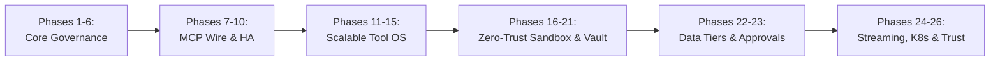

# Aegis Gateway: Master Multi-Phase Enterprise Roadmap

> **Status**: Active Living Roadmap  
> **Target Standard**: SOC 2 Type II, ISO 27001, HIPAA, PCI-DSS, NIST AI RMF, OWASP Agentic AI Top 10  
> **License**: MIT (Permissive)  
> **Architecture Core**: SOLID, Zero Unsafe Code, Dependency Inversion

---
## Executive Summary

`Aegis Gateway` is engineered to solve the fundamental enterprise readiness deficit present in first-generation MCP gateways. First-generation proxies suffer from in-memory state lock-in, coarse role bits, zero data-loss prevention, and non-commercial license traps.

Aegis Gateway establishes a **Cloud-Native, Enterprise-by-Design Control Plane** mediating all AI agent tool and skill invocations.

## Milestone Master Ledger

| Phase | Category | Focus Areas | Status | Spec Document |
| :--- | :--- | :--- | :--- | :--- |
| **Phase 1** | **Distributed Foundation** | Distributed State Backend, Redis Cluster, K8s Probes & Draining | `Completed` | [`01_PHASE_1_DISTRIBUTED_FOUNDATION.md`](./01_PHASE_1_DISTRIBUTED_FOUNDATION.md) |
| **Phase 2** | **Zero-Trust IAM & ABAC** | OIDC/JWT Validation, Granular ABAC Payload Evaluation & SCIM | `Completed` | [`02_PHASE_2_ZERO_TRUST_IAM_ABAC.md`](./02_PHASE_2_ZERO_TRUST_IAM_ABAC.md) |
| **Phase 3** | **Real-Time DLP** | PCI-DSS Card Masking, HIPAA PHI Scrubbing & Request Sanitization | `Completed` | [`03_PHASE_3_REALTIME_DLP_GUARDRAILS.md`](./03_PHASE_3_REALTIME_DLP_GUARDRAILS.md) |
| **Phase 4** | **SIEM Audit** | Tamper-Evident SHA-256 Hash Chaining, Splunk/Datadog Sinks & W3C Tracing | `Completed` | [`04_PHASE_4_IMMUTABLE_AUDIT_SIEM.md`](./04_PHASE_4_IMMUTABLE_AUDIT_SIEM.md) |
| **Phase 5** | **FinOps & Multi-Tenancy** | Real-Time Token Quotas, Soft Alerts, Hard Freeze & Chargeback | `Completed` | [`05_PHASE_5_FINOPS_MULTI_TENANCY.md`](./05_PHASE_5_FINOPS_MULTI_TENANCY.md) |
| **Phase 6** | **Centralized Skill OS** | Progressive Disclosure, GitOps Verification & Semantic Tool Retrieval | `Completed` | [`06_PHASE_6_CENTRALIZED_SKILL_OS.md`](./06_PHASE_6_CENTRALIZED_SKILL_OS.md) |
| **Phase 7** | **MCP Wire Transports** | Stdio Frame Framing, SSE, Streamable HTTP & Ping Lifecycles | `Completed` | [`07_PHASE_7_MCP_WIRE_TRANSPORTS.md`](./07_PHASE_7_MCP_WIRE_TRANSPORTS.md) |
| **Phase 8** | **Subprocess Multiplexing**| Multi-Backend Registry, Hermetic Env Isolation & Subprocess Reaping | `Completed` | [`08_PHASE_8_BACKEND_MULTIPLEXING_CONFIG.md`](./08_PHASE_8_BACKEND_MULTIPLEXING_CONFIG.md) |
| **Phase 9** | **CLI Daemon & Parity** | Daemon Lifecycle, Config Validation, Doctor & Parity Bugfixes | `Completed` | [`09_PHASE_9_PRODUCTION_CLI_DAEMON.md`](./09_PHASE_9_PRODUCTION_CLI_DAEMON.md) |
| **Phase 10**| **Graduated E2E Testing** | 6-Tier Enterprise Testing Matrix (Hobbyist to Financial) | `Completed` | [`10_GRADUATED_E2E_TESTING_FRAMEWORK.md`](./10_GRADUATED_E2E_TESTING_FRAMEWORK.md) |
| **Phase 11**| **Search & Real Routing** | Hybrid Semantic Search, Real Wire Routing & Zero Mock Enforcement | `Completed` | [`11_PHASE_11_SEARCH_PLANNING_ZERO_MOCKS.md`](./11_PHASE_11_SEARCH_PLANNING_ZERO_MOCKS.md) |
| **Phase 12**| **Egress & Attestation** | SSRF Guardrails, Refusal Audit Integrity & Tool Outcome Attestation | `Completed` | [`12_PHASE_12_EGRESS_GUARDRAILS_REFUSAL_INTEGRITY_AND_OUTCOME_ATTESTATION.md`](./12_PHASE_12_EGRESS_GUARDRAILS_REFUSAL_INTEGRITY_AND_OUTCOME_ATTESTATION.md) |
| **Phase 13**| **Stream Buffers & Reaping**| Reusable Stream Buffers, OAuth Resource Metadata & Process Reaping | `Completed` | [`13_PHASE_13_STREAM_BUFFER_REUSE_OAUTH_RESOURCE_METADATA_AND_PROCESS_REAPER.md`](./13_PHASE_13_STREAM_BUFFER_REUSE_OAUTH_RESOURCE_METADATA_AND_PROCESS_REAPER.md) |
| **Phase 14**| **Session Fence & Indexing**| Session Fence, Configurable OAuth Host, Typed SSRF & Deep Indexing | `Completed` | [`14_PHASE_14_SESSION_TEARDOWN_FENCE_CONFIGURABLE_OAUTH_CALLBACK_HOST_TYPED_SSRF_REFUSAL_AND_LARGE_CATALOG_DEEP_INDEXING.md`](./14_PHASE_14_SESSION_TEARDOWN_FENCE_CONFIGURABLE_OAUTH_CALLBACK_HOST_TYPED_SSRF_REFUSAL_AND_LARGE_CATALOG_DEEP_INDEXING.md) |
| **Phase 15**| **DAG & Semantic RRF** | Runtime DAG Interpolation & Hybrid Semantic RRF Tool Engine | `Completed` | [`15_PHASE_15_RUNTIME_DAG_EXPRESSION_INTERPOLATION_PIPELINE_AND_HYBRID_SEMANTIC_RRF_TOOL_RETRIEVAL_ENGINE.md`](./15_PHASE_15_RUNTIME_DAG_EXPRESSION_INTERPOLATION_PIPELINE_AND_HYBRID_SEMANTIC_RRF_TOOL_RETRIEVAL_ENGINE.md) |
| **Phase 16**| **Code Sandbox & Firewall** | Universal Code Sandbox, Credential Brokerage & Egress Firewall | `Completed` | [`16_PHASE_16_UNIVERSAL_CODE_SANDBOX_CREDENTIAL_BROKER_AND_EGRESS_FIREWALL.md`](./16_PHASE_16_UNIVERSAL_CODE_SANDBOX_CREDENTIAL_BROKER_AND_EGRESS_FIREWALL.md) |
| **Phase 17**| **Dynamic Vault & Rotation**| Infisical Secret Store, Zero-Plaintext on Disk & Hot Rotation | `Completed` | [`17_PHASE_17_DYNAMIC_ENTERPRISE_SECRET_VAULT_AND_ROTATION.md`](./17_PHASE_17_DYNAMIC_ENTERPRISE_SECRET_VAULT_AND_ROTATION.md) |
| **Phase 18**| **Egress Credential Proxy** | Loopback Proxy Sidecar, Zero-Secret Process Space & Anti-Obfuscation | `Completed` | [`18_PHASE_18_ZERO_KNOWLEDGE_EGRESS_CREDENTIAL_PROXY.md`](./18_PHASE_18_ZERO_KNOWLEDGE_EGRESS_CREDENTIAL_PROXY.md) |
| **Phase 19**| **HITL Approval Gate** | Declarative Action Risk Classification & Suspended Task State | `Completed` | [`19_PHASE_19_HUMAN_IN_THE_LOOP_APPROVAL_GATE_AND_HIGH_RISK_INTERCEPTOR.md`](./19_PHASE_19_HUMAN_IN_THE_LOOP_APPROVAL_GATE_AND_HIGH_RISK_INTERCEPTOR.md) |
| **Phase 20**| **Identity Delegation** | 3-Legged OAuth OBO Impersonation & Virtual Resource Isolation | `Completed` | [`20_PHASE_20_USER_DELEGATED_IDENTITY_AND_BLAST_RADIUS_SCOPING.md`](./20_PHASE_20_USER_DELEGATED_IDENTITY_AND_BLAST_RADIUS_SCOPING.md) |
| **Phase 21**| **Managed OAuth Connect** | RFC 9728 Discovery, Vendor-Agnostic PKCE Router & Auth Lifecycle | `Completed` | [`21_PHASE_21_AGNOSTIC_MANAGED_OAUTH_CONNECT_ENGINE.md`](./21_PHASE_21_AGNOSTIC_MANAGED_OAUTH_CONNECT_ENGINE.md) |
| **Phase 22**| **Policy Tiers & In-Situ** | Configurable Profiles (Dev/Hybrid/Strict) & In-Situ Data Enclave | `Completed` | [`22_PHASE_22_CONFIGURABLE_POLICY_TIERS_AND_IN_SITU_DATA_ENCLAVE.md`](./22_PHASE_22_CONFIGURABLE_POLICY_TIERS_AND_IN_SITU_DATA_ENCLAVE.md) |
| **Phase 23**| **Multi-Channel Approval** | Pluggable Approval Dispatcher (Slack/Teams/Webhook) & Resume Router | `Completed` | [`23_PHASE_23_PLUGGABLE_MULTI_CHANNEL_APPROVAL_DISPATCHER_AND_DURABLE_RESUME.md`](./23_PHASE_23_PLUGGABLE_MULTI_CHANNEL_APPROVAL_DISPATCHER_AND_DURABLE_RESUME.md) |
| **Phase 24**| **Multi-Modal Streaming Vault** | Zero-Buffer Chunking (TUS), Magic Byte Inspection & Ephemeral Egress | `Completed` | [`24_PHASE_24_MULTI_MODAL_STREAMING_AND_CHUNKED_BINARY_VAULT.md`](./24_PHASE_24_MULTI_MODAL_STREAMING_AND_CHUNKED_BINARY_VAULT.md) |
| **Phase 25**| **Kubernetes Operator & CRDs** | Declarative GitOps Reconciler, CRD Specs & Mutating Sidecar Injection | `Completed` | [`25_PHASE_25_KUBERNETES_OPERATOR_AND_DECLARATIVE_CRD_ENGINE.md`](./25_PHASE_25_KUBERNETES_OPERATOR_AND_DECLARATIVE_CRD_ENGINE.md) |
| **Phase 26**| **AgentCert Trust & Evidence** | Ed25519 Agent Identity, URL Threat Intel Preflight & Opt-in CORS | `Completed` | [`26_PHASE_26_AGENT_CERT_TRUST_AND_THREAT_EVIDENCE_ENRICHMENT.md`](./26_PHASE_26_AGENT_CERT_TRUST_AND_THREAT_EVIDENCE_ENRICHMENT.md) |
| **Phase 27**| **Dynamic Control Plane & Hot-Reload** | Zero-Downtime Hot-Reload, In-Memory Atomic Swapping & Admin API | `Completed` | [`27_PHASE_27_DYNAMIC_RUNTIME_CONTROL_PLANE_AND_HOT_RELOAD.md`](./27_PHASE_27_DYNAMIC_RUNTIME_CONTROL_PLANE_AND_HOT_RELOAD.md) |
| **Phase 28**| **Distributed Cluster Sync & Pub/Sub** | Multi-Pod Cross-Node State Synchronization & Checksum Bus | `Completed` | [`28_PHASE_28_DISTRIBUTED_CLUSTER_SYNC_AND_PUBSUB_CONTROL_BUS.md`](./28_PHASE_28_DISTRIBUTED_CLUSTER_SYNC_AND_PUBSUB_CONTROL_BUS.md) |
| **Phase 29**| **Modern MCP 2026-07-28 & Dual-Stack** | Stateless Header Routing, Anti-Desync Protection & Cache TTL | `Completed` | [`29_PHASE_29_MODERN_STATELESS_MCP_2026_07_28_AND_DUAL_STACK.md`](./29_PHASE_29_MODERN_STATELESS_MCP_2026_07_28_AND_DUAL_STACK.md) |
| **Phase 30**| **Native Ingress TLS, mTLS & ACME** | Pure-Rust TLS (rustls), mTLS Client Verification & Auto-ACME | `Completed` | [`30_PHASE_30_NATIVE_INGRESS_TLS_MTLS_AND_ACME.md`](./30_PHASE_30_NATIVE_INGRESS_TLS_MTLS_AND_ACME.md) |
| **Phase 31**| **Identity Federation (SAML & SCIM)** | SAML 2.0 Web SSO & SCIM 2.0 Inbound Directory Provisioning | `Completed` | [`31_PHASE_31_ENTERPRISE_IDENTITY_FEDERATION_SAML_AND_SCIM.md`](./31_PHASE_31_ENTERPRISE_IDENTITY_FEDERATION_SAML_AND_SCIM.md) |
| **Phase 32**| **Direct OTLP Telemetry Exporter** | CNCF OpenTelemetry Protocol (gRPC/HTTP) & Adaptive Sampler | `Completed` | [`32_PHASE_32_DIRECT_OTLP_TELEMETRY_EXPORTER.md`](./32_PHASE_32_DIRECT_OTLP_TELEMETRY_EXPORTER.md) |
| **Phase 33**| **Single-Binary Embedded Admin Web UI** | Svelte 5, Bun, TypeScript, shadcn-svelte, Multi-Theme & Anti-Slop | `Completed` | [`33_PHASE_33_EMBEDDED_ADMIN_WEB_UI.md`](./33_PHASE_33_EMBEDDED_ADMIN_WEB_UI.md) |
| **Phase 34**| **Embedded UI Enterprise Control Suite** | Interactive Backends, Live Policy Switcher, Tool Playground & SIEM Audit | `In Planning` | [`34_PHASE_34_EMBEDDED_UI_ENTERPRISE_CONTROL_SUITE.md`](./34_PHASE_34_EMBEDDED_UI_ENTERPRISE_CONTROL_SUITE.md) |
| **Phase 35**| **Live Data Plane Binding & Zero-Mock UI** | Runtime Engine Dependency Injection, Live OS Telemetry & Zero-Mock UI | `In Progress` | [`35_PHASE_35_LIVE_DATA_PLANE_BINDING_AND_ZERO_MOCK_UI.md`](./35_PHASE_35_LIVE_DATA_PLANE_BINDING_AND_ZERO_MOCK_UI.md) |

---

## Continuous Update & Maintenance Policy

1. **Deterministic Verification**: Every milestone marked completed `[x]` MUST have passing empirical tests in `tests/` and be verified by `scripts/governance-check.sh`.
2. **Synchronized Tracking**: Any milestone status transition MUST be mirrored in `/root/GEMINI.md` under the mandatory checklist.
3. **No Breaking SOLID Changes**: Enhancements in future phases must be achieved via trait extension (Open/Closed Principle), preserving existing interfaces.
