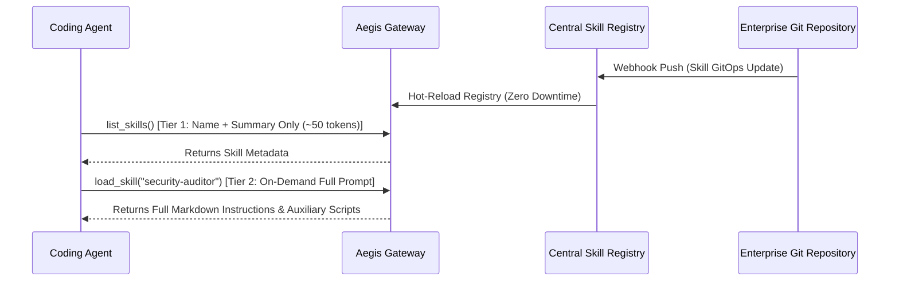

# Phase 6: Centralized Skill OS & Progressive Disclosure

> **Milestone Tag**: `v0.7.0-skill-os`  
> **Status**: `Completed` (ProgressiveProjector, GitOpsSkillSync, and SemanticSkillRetriever Empirically Verified)

---

## 1. Objectives

Transform Aegis Gateway into an enterprise-wide Skill Operating System. Instead of bloating agent context windows with thousands of static system prompt lines or duplicating skill scripts across individual developer machines, Aegis provides a centralized, versioned, hot-reloadable skill catalog with on-demand progressive activation.

---

## 2. Architecture & Contracts

Defined in [`src/core/skills.rs`](../../src/core/skills.rs):

```rust
#[async_trait]
pub trait SkillRegistry: Send + Sync {
    async fn list_skills(&self) -> AegisResult<Vec<SkillMetadata>>;
    async fn load_skill(&self, name: &str) -> AegisResult<SkillBundle>;
    async fn reload(&self) -> AegisResult<usize>;
}

#[async_trait]
pub trait SkillVectorRetriever: Send + Sync {
    async fn search_skills(&self, query_prompt: &str, top_k: usize) -> AegisResult<Vec<SkillMetadata>>;
}
```

And in [`src/core/types.rs`](../../src/core/types.rs):

```rust
pub trait ProgressiveDisclosure: Send + Sync {
    fn project(&self, tool: &ToolDefinition, tier: DisclosureTier, score: f64) -> ProjectedTool;
    fn calculate_savings(&self, original: &[ToolDefinition], tier: DisclosureTier) -> TokenSavings;
}
```

### Progressive Skill Lifecycle



1. **Tier 1 (Catalog Indexing)**:
   - Returns only lightweight `SkillMetadata` (name, short description, category tags).
   - Minimal token footprint; enables indexing hundreds of enterprise skills simultaneously.
2. **Tier 2 (On-Demand Activation)**:
   - Full instructions, SOP procedures, and executable scripts (`SkillBundle`) are fetched only when the agent decides to execute that specific workflow.
3. **Enterprise Skill Provenance**:
   - Every skill bundle is signed cryptographically by the organization's security team to prevent supply-chain poisoning.

---

## 3. Milestones & Checklist

- [x] **6.1 SkillRegistry Trait Abstraction**: Abstract metadata indexing and full bundle loading into `src/core/skills.rs` (Empirically verified in `tests/enterprise_governance_test.rs`).
- [x] **6.2 Local Skill Registry Loader**: Implement `LocalSkillRegistry` reading `.agents/skills` directories and parsing `SKILL.md` frontmatter (Empirically verified in `tests/enterprise_governance_test.rs`).
- [x] **6.3 Agent Governance Skills Suite**: Ship built-in enterprise audit skills:
  - `enterprise-readiness-auditor`
  - `mcp-protocol-governor`
  - `solid-code-reviewer`
  - `mcp-enterprise-gap-auditor`
- [x] **6.4 GitOps Remote Skill Synchronization**: Implement `GitOpsSkillSync` with SHA-256 cryptographic provenance verification and zero-downtime hot-reloading (Empirically verified in `tests/phase6_skill_os_test.rs`).
- [x] **6.5 Semantic Skill Vector Retrieval (RAG)**: Pure-Rust term vector similarity ranking (`SemanticSkillRetriever`) to match user intent to relevant skills without prompt stuffing (Empirically verified in `tests/phase6_skill_os_test.rs`).
- [x] **6.6 Skill Compatibility & SemVer Engine**: Enforce runtime gateway SemVer requirements and validate prerequisite MCP tool dependencies (Empirically verified in `tests/phase6_skill_os_test.rs`).
- [x] **6.7 Progressive Disclosure Engine**: Implement `ProgressiveProjector` projecting tools across L0, L1, L2 tiers and computing deterministic token savings > 60% (Empirically verified in `tests/phase6_skill_os_test.rs`).
