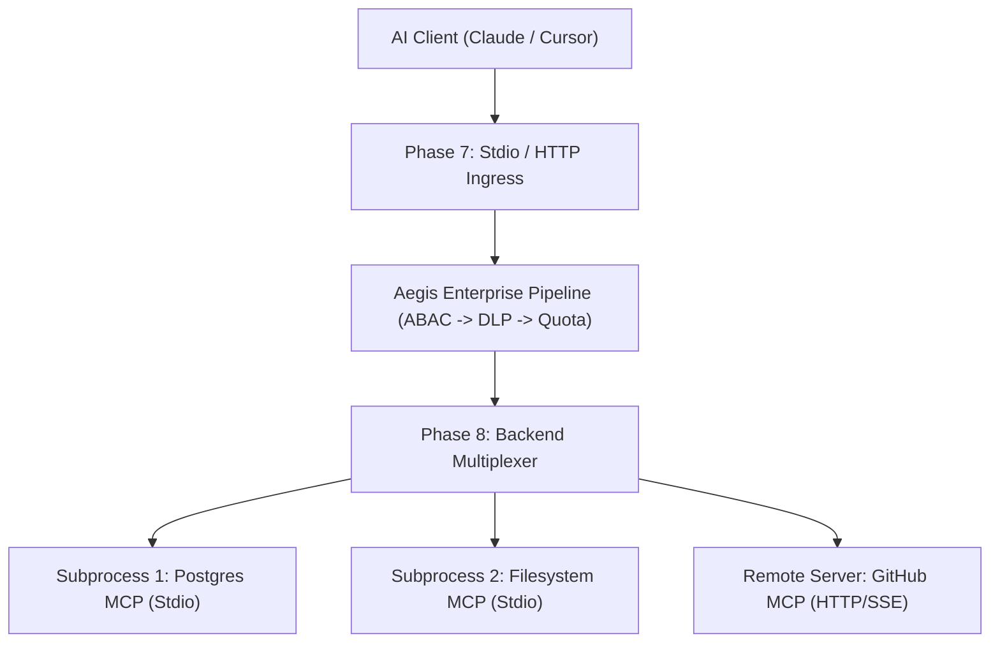

# Phase 8: Backend Process Spawning, Upstream Multiplexing & Config Engine

> **Milestone Tag**: `v0.9.0-backend-multiplexing`  
> **Status**: `Planned`  
> **Target Standard**: Process Supervision, Cross-Server Routing & Drop-in Configuration

---

## 1. Objectives

Enable Aegis Gateway to act as a true operational reverse proxy for arbitrary backend MCP servers (Node.js/npx, Python, Go, Docker, or remote HTTP/SSE servers). Load server topologies declaratively from configuration files (`aegis.yaml`), manage backend process lifecycles, and dynamically aggregate tool catalogs.

---

## 2. Architecture & Contracts

Defined in `src/core/backend.rs` (to be created):

```rust
#[async_trait]
pub trait BackendTransport: Send + Sync {
    async fn start(&self) -> AegisResult<()>;
    async fn send_request(&self, request: &JsonRpcRequest) -> AegisResult<JsonRpcResponse>;
    async fn is_healthy(&self) -> bool;
    async fn stop(&self) -> AegisResult<()>;
}

#[async_trait]
pub trait BackendRegistry: Send + Sync {
    async fn register_backend(&self, name: &str, transport: Arc<dyn BackendTransport>) -> AegisResult<()>;
    async fn get_backend(&self, name: &str) -> AegisResult<Arc<dyn BackendTransport>>;
    async fn discover_all_tools(&self) -> AegisResult<Vec<ToolDefinition>>;
}
```

### Operational Proxy Flow



---

## 3. Milestones & Checklist

- [ ] **8.1 Declarative Configuration Parser (`aegis.yaml`)**: Parse backend definitions supporting `command`, `args`, `env`, and remote `url` formats compatible with Claude Desktop and legacy `gateway.yaml`.
- [ ] **8.2 Stdio Subprocess Spawner & Lifecycle Supervisor**: Spawn asynchronous child processes with piped standard IO, automatic restart on crash, and clean process group termination on exit.
- [ ] **8.3 Remote HTTP/SSE Backend Connector**: Forward tool calls to remote network-attached MCP endpoints with connection pooling and timeouts.
- [ ] **8.4 Automated Catalog Aggregation**: Interrogate all registered backends via `tools/list` upon startup, map to Aegis `ToolDefinition`, and populate the registry dynamically.
- [ ] **8.5 Full End-to-End Operational Pipeline**: Complete transparent bidirectional proxying uniting Client Ingress, Enterprise Control Plane, and Upstream Backends.
