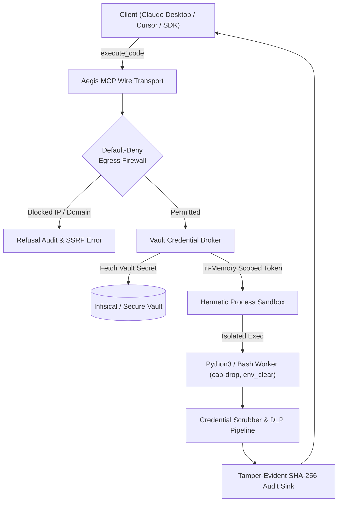

# Phase 16: Universal Context-Agnostic Hermetic Code Sandbox, Centralized Credential Broker, and Default-Deny Egress Firewall

> **Milestone Tag**: `v1.16.0-universal_code_sandbox_credential_broker_and_egress_firewall`  
> **Status**: `Completed`  
> **Target Standards**: SOC 2 Type II, ISO 27001, PCI-DSS, OWASP Agentic AI Top 10 (LLM01, LLM02, LLM07, LLM08)  
> **Target Gaps & Issues**:
> - Resolves `SANDBOX-01`: Unconstrained Remote Code Execution (RCE by Design)
> - Resolves `SANDBOX-02`: SSRF and Network Data Exfiltration
> - Resolves `SANDBOX-03`: Credential Leakage & Token Scope Creep
> - Resolves `SANDBOX-04`: Non-Repudiation & Cryptographic Audit Ledger Deficit

---

## 1. Problem Statement & Motivation

First-generation Model Context Protocol (MCP) gateways forced a false dichotomy on enterprise AI agents:
1. **Granular Declarative Tool Proliferation**: Attempting to expose every single API capability (such as Google Drive/Docs/Sheets, database manipulations, or complex data processing) as dozens of fine-grained MCP tools. This floods client prompt context (30k+ tokens), introduces severe multi-hop latency, and drastically reduces agent reasoning accuracy.
2. **Unconstrained Local Agent Shell Execution**: Forcing developers to grant autonomous agents unrestricted local shell access (e.g. bash/python on developer laptops or backend servers), leaking master secrets, risking host root privilege escalation, and exposing internal VPC networks to Server-Side Request Forgery (SSRF).

`Aegis Gateway Phase 16` resolves this fundamental architectural divide through a **Universal Context-Agnostic Hermetic Code Sandbox with Centralized Credential Brokerage and Default-Deny Egress Firewall**.

---

## 2. The 4 Enterprise CISO Pillars & Mitigations

### Pillar 1: Hermetic Process Sandbox (`SANDBOX-01`)
- **Zero Host Leakage**: Processes run with `env_clear()`, inheriting zero host environment variables.
- **Ephemeral Lifecycle**: Ephemeral scratch directory on ramdisk/tempfs generated per execution and deleted immediately on process exit.
- **Strict Resource Quotas**: Configurable execution timeouts (default 30s) and buffer truncation (512KB) preventing memory exhaustion and denial-of-service. Process tree terminated forcefully via `kill_on_drop(true)`.

### Pillar 2: Default-Deny Egress Firewall (`SANDBOX-02`)
- **Preflight Code & Destination Inspection**: Static analysis inspects code and destination URLs/IPs before execution.
- **Cloud Metadata & RFC1918 Blocking**: Hard rejection of cloud metadata (`169.254.169.254`, `metadata.google.internal`), loopback (`127.0.0.1`, `localhost`), and private subnets (`10.0.0.0/8`, `172.16.0.0/12`, `192.168.0.0/16`).
- **Domain Whitelisting**: Outbound egress is strictly restricted to approved enterprise service domains (e.g., `googleapis.com`, `github.com`).

### Pillar 3: Zero-Knowledge Credential Brokerage (`SANDBOX-03`)
- **Zero-Knowledge LLM**: The AI model never receives or generates long-lived refresh tokens or client secrets.
- **Just-In-Time RAM Injection**: Tokens are brokered from centralized secrets storage (Infisical / Vault) directly into child process environment variables in memory at runtime.
- **Bidirectional Output Scrubbing**: All brokered credential values are automatically registered with the redaction engine. Any accidental `print(os.environ)` or stack trace is dynamically masked to `[REDACTED_CREDENTIAL]`.

### Pillar 4: Non-Repudiation & Cryptographic Audit (`SANDBOX-04`)
- **SHA-256 Script Fingerprint**: Every script executed is hashed prior to launch and immutably recorded in the Aegis audit trail.
- **Cryptographic Attestation Receipt**: Audit log includes caller tenant, execution duration, exit code, and cryptographic attestation signature for SOC 2 Type II compliance.

---

## 3. Trait Contracts & Architecture

The architecture enforces interface-first design in `src/core/sandbox.rs`:
- `CodeSandboxEngine`: Abstract contract for language execution.
- `CredentialBroker`: Abstract contract for resolving credentials and redacting secrets.
- `EgressFirewall`: Abstract contract for evaluating egress destinations and code patterns.

---

## 4. Empirical Verification Plan

1. **Golden Path**: Pure calculation and data transformation in Python without egress.
2. **SSRF Blocking**: Attempted connections to cloud metadata (`169.254.169.254`) and unauthorized domains rejected pre-execution.
3. **Secret Redaction**: Code intentionally printing brokered environment variables receives masked output.
4. **Execution Timeout**: Infinite loops terminated cleanly within configured timeout.
5. **Cryptographic Attestation**: Execution events verifiable in audit ledger with SHA-256 hash chaining.
