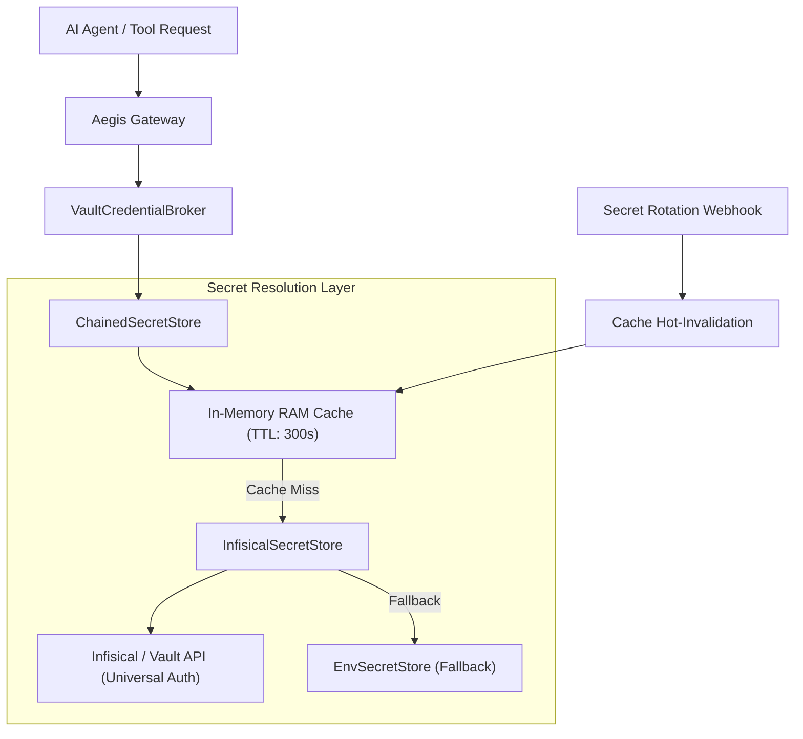

# Phase 17: Dynamic Enterprise Secret Vault & Hot-Rotation Provider

> **Status**: Planned / Roadmap  
> **Target Standard**: SOC 2 Type II, ISO 27001 (A.9.4.2 Secret Management), NIST AI RMF  
> **Interface-First Contract**: `pub trait SecretStore`, `pub struct InfisicalSecretStore`  
> **File Line Constraint**: Strictly `<= 350 lines`

---

## 1. Enterprise Problem & Motivation

First-generation MCP implementations and naive AI agent sandboxes rely on static plaintext `.env` files written to host disk during deployment. In an enterprise setting, this introduces critical operational and security deficits:
1. **Plaintext on Disk Vulnerability**: Any unprivileged host access or filesystem backup exposes long-lived API keys, client secrets, and refresh tokens.
2. **Downtime on Secret Rotation**: Whenever an OAuth token is refreshed or an enterprise key rotated, the application container must be rebuilt or restarted, breaking active agent sessions.
3. **Audit Trail Vacuum**: Local `.env` reads provide zero access logs to central Security Information & Event Management (SIEM) platforms, failing SOC 2 Access Control requirements.

---

## 2. Core Architectural Design

Phase 17 integrates Aegis Gateway directly with central secret managers (Infisical, HashiCorp Vault) using Universal Auth Machine Identities without storing plaintext secrets on disk.



---

## 3. SOLID Trait Contract Specification

The implementation adheres to Interface-First and Dependency Inversion principles:

```rust
#[async_trait]
pub trait SecretStore: Send + Sync {
    /// Retrieve secret value by name or hierarchical path
    async fn get_secret(&self, key: &str) -> AegisResult<Option<String>>;

    /// Store or update secret (subject to role permissions)
    async fn set_secret(&self, key: &str, value: &str) -> AegisResult<()>;

    /// Invalidate in-memory cache entry for a given secret
    async fn invalidate(&self, key: &str) -> AegisResult<()>;

    /// Check backend vault availability
    async fn health_check(&self) -> AegisResult<bool>;
}
```

### Components:
- **`InfisicalSecretStore`**: Machine Identity Universal Auth client authenticating via `client_id` and `client_secret`, querying Infisical v3 REST API.
- **`ChainedSecretStore`**: Multi-tiered fallback store providing local memory cache -> external vault -> environment fallback.
- **`SecretRotationWebhookHandler`**: Endpoint `/api/v1/secrets/invalidate` receiving HMAC-verified webhook triggers to purge stale secrets without restarting.

---

## 4. Graduated Verification Plan
- [ ] **Unit Tests**: In-memory cache hit/miss, TTL expiration, chained store fallbacks.
- [ ] **Integration Tests**: Mocked and live Universal Auth token exchange, secret retrieval, and hot-invalidation.
- [ ] **Compliance Audit**: Zero plaintext secrets on disk verified by automated filesystem scanners.
