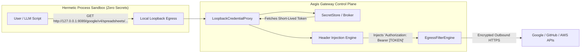

# Phase 18: Zero-Knowledge Egress Credential Proxy

> **Status**: Planned / Roadmap  
> **Target Standard**: OWASP LLM01 (Prompt Injection), OWASP LLM06 (Sensitive Information Disclosure), SOC 2 Type II  
> **Interface-First Contract**: `pub trait CredentialProxyEngine`, `pub struct LoopbackCredentialProxy`  
> **File Line Constraint**: Strictly `<= 350 lines`

---

## 1. Enterprise Problem & Motivation

Even with hermetic process isolation and post-execution substring redaction (`[REDACTED_CREDENTIAL]`), injecting raw credentials directly into a sandbox's environment variables (`os.environ["GOOGLE_ACCESS_TOKEN"]`) exposes enterprise infrastructure to severe attack vectors:
1. **Redaction Bypass via Encoding**: An adversarial prompt or compromised tool output can instruct the script to encode the token before printing:
   ```python
   # Bypasses naive string replacement
   print(base64.b64encode(os.environ["GOOGLE_ACCESS_TOKEN"].encode()))
   print([ord(c) for c in os.environ["GOOGLE_ACCESS_TOKEN"]])
   ```
2. **In-Process Memory Inspection**: Any language runtime running untrusted code has full introspection capabilities over its own memory space (`/proc/self/environ`, heap inspection).
3. **The Confused Deputy Exfiltration**: An indirect prompt injection in an external document can trick the model into exfiltrating raw credentials into third-party storage.

---

## 2. Core Architectural Design

Phase 18 introduces a **Loopback Sidecar Reverse Proxy**. The sandbox runtime receives **ZERO raw tokens in its process environment**. All authentication occurs transparently at the network transport boundary.



---

## 3. SOLID Trait Contract Specification

```rust
#[async_trait]
pub trait CredentialProxyEngine: Send + Sync {
    /// Start an ephemeral loopback proxy bound to an isolated port
    async fn bind_ephemeral_proxy(&self, session_id: &str) -> AegisResult<ProxyBinding>;

    /// Inject authentication headers for authorized upstream domains
    async fn inject_upstream_auth(
        &self,
        request: hyper::Request<hyper::body::Incoming>,
        target_service: &str,
    ) -> AegisResult<hyper::Request<hyper::body::Incoming>>;

    /// Shutdown the ephemeral proxy and flush associated memory buffers
    async fn teardown_proxy(&self, session_id: &str) -> AegisResult<()>;
}
```

### Key Security Invariants:
1. **Zero Secret Address Space**: `os.environ` contains only `GOOGLE_API_BASE=http://127.0.0.1:8089/google` or `HTTP_PROXY=http://127.0.0.1:8089`. No secret strings exist in the script's heap or environment.
2. **Mathematical Impossibility of Exfiltration**: A script cannot leak, encode, or exfiltrate a secret token it physically does not possess.
3. **Strict Egress Whitelist Binding**: The loopback proxy only injects credentials when the upstream destination matches the whitelisted service domain.

---

## 4. Graduated Verification Plan
- [ ] **Unit Tests**: Header injection for Google OAuth2, GitHub App tokens, and AWS SigV4.
- [ ] **Adversarial Redaction Tests**: Scripts attempting Base64, Hex, ROT13, and character-array extraction return 0 credentials.
- [ ] **Network Isolation Tests**: Ephemeral loopback sockets automatically bound and torn down per sandbox execution.
