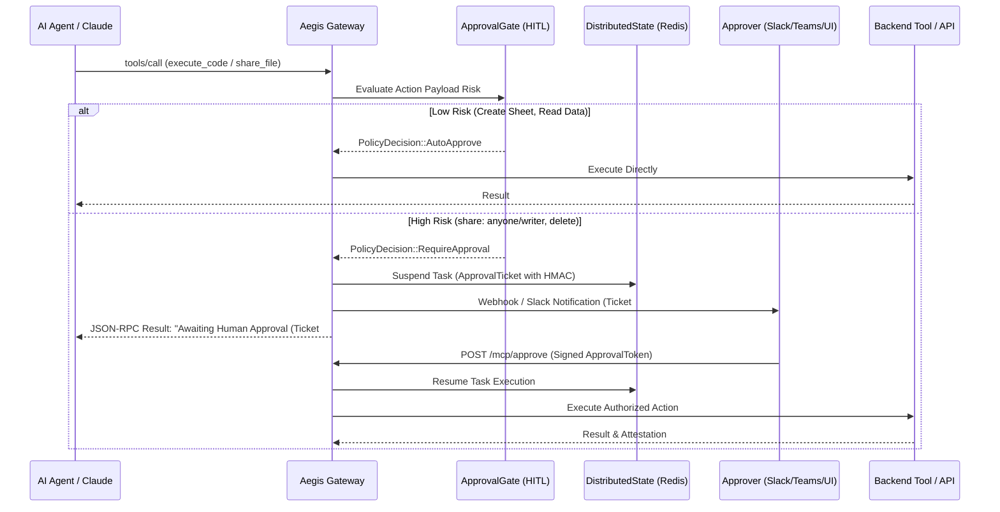

# Phase 19: Human-in-the-Loop (HITL) Approval Gate & High-Risk Interceptor

> **Status**: Planned / Roadmap  
> **Target Standard**: NIST AI RMF (Govern 1.2), ISO 42001 (Artificial Intelligence Management), SOC 2 Type II  
> **Interface-First Contract**: `pub trait ApprovalGate`, `pub struct ActionApprovalGate`  
> **File Line Constraint**: Strictly `<= 350 lines`

---

## 1. Enterprise Problem & Motivation

Autonomous AI agents operating without supervised gates create catastrophic risk when executing high-impact, irreversible operations:
1. **Unilateral Public Exposure**: Changing internal document permissions to `anyone: writer` leaks proprietary IP without executive or compliance oversight.
2. **Destructive Operations**: Invocations of `files.delete`, `rm -rf`, database drops, or Kubernetes namespace purges executed purely on hallucinated agent initiative.
3. **Privilege Escalation**: Modifying IAM policies, adding external collaborators, or generating personal access tokens without secondary authorization.

Enterprise CISO policies mandate that autonomous tools must be bounded by **Human-in-the-Loop (HITL) gates** for critical operations.

---

## 2. Core Architectural Design

Phase 19 equips Aegis Gateway with a **Declarative Risk Classifier and Async Approval Interceptor**.



---

## 3. SOLID Trait Contract Specification

```rust
#[derive(Debug, Clone, PartialEq, Eq)]
pub enum RiskTier {
    Low,
    Medium,
    High,
    Critical,
}

#[derive(Debug, Clone)]
pub struct ApprovalTicket {
    pub ticket_id: String,
    pub session_id: String,
    pub caller_id: String,
    pub action_name: String,
    pub payload_summary: serde_json::Value,
    pub risk_tier: RiskTier,
    pub hmac_signature: String,
    pub expires_at: chrono::DateTime<chrono::Utc>,
}

#[async_trait]
pub trait ApprovalGate: Send + Sync {
    /// Classify proposed action into risk tiers
    async fn evaluate_risk(&self, tool_name: &str, payload: &serde_json::Value) -> AegisResult<RiskTier>;

    /// Create and persist an approval ticket, suspending task execution
    async fn create_ticket(&self, ticket: ApprovalTicket) -> AegisResult<()>;

    /// Validate cryptographically signed approval and resume execution
    async fn resolve_ticket(&self, ticket_id: &str, signature: &str, approved: bool) -> AegisResult<bool>;
}
```

---

## 4. Graduated Verification Plan
- [ ] **Risk Evaluation Tests**: Automated detection of public sharing (`anyone/writer`), deletion, and IAM alterations.
- [ ] **Lifecycle Tests**: Task suspension, HMAC ticket validation, expiration, and resume flows.
- [ ] **Webhook Integration Tests**: Slack / Teams payload dispatch and interactive approval callbacks.
