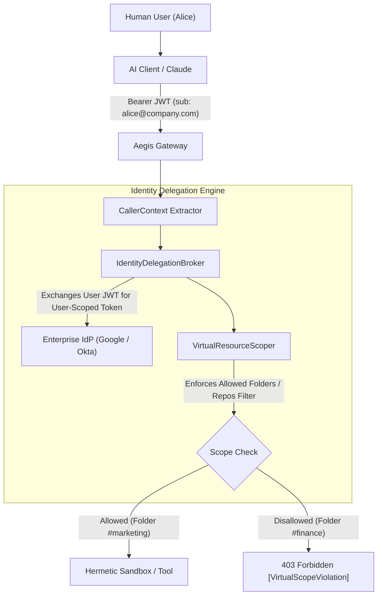

# Phase 20: User-Delegated Identity & Virtual Blast Radius Scoping

> **Status**: Planned / Roadmap  
> **Target Standard**: SOC 2 Type II (CC6.1 Logical Access), ISO 27001 (A.9.2 User Access Management)  
> **Interface-First Contract**: `pub trait IdentityDelegationBroker`, `pub trait ResourceScoper`  
> **File Line Constraint**: Strictly `<= 350 lines`

---

## 1. Enterprise Problem & Motivation

Enterprise deployments connecting AI agents to enterprise suites (Google Workspace, GitHub, Slack) encounter critical identity governance failures when using static shared credentials:
1. **The Shared Master Account Anti-Pattern**: If all agents share a single service account or administrative OAuth token, every file edited and message posted is attributed to the master account. This breaks non-repudiation, making it impossible to audit which human authorized the action.
2. **Coarse-Grained Blast Radius**: A token authorized for Google Drive often grants broad access across the entire organizational drive rather than confining the agent to a specific project subfolder.
3. **Cross-Tenant Contamination**: Without strict user-bound credential isolation, Agent A (operated by User X) can access confidential documents belonging to User Y.

---

## 2. Core Architectural Design

Phase 20 implements **User-Delegated 3-Legged OAuth Impersonation** and **Virtual Resource Scoping**.



---

## 3. SOLID Trait Contract Specification

```rust
#[async_trait]
pub trait IdentityDelegationBroker: Send + Sync {
    /// Resolve user-specific delegated token based on caller identity
    async fn resolve_user_token(
        &self,
        caller: &CallerContext,
        target_service: &str,
    ) -> AegisResult<DelegatedToken>;

    /// Invalidate delegated session token on user sign-out
    async fn revoke_user_session(&self, session_id: &str) -> AegisResult<()>;
}

#[async_trait]
pub trait ResourceScoper: Send + Sync {
    /// Verify target resource URI conforms to caller's permitted virtual scope
    async fn validate_resource_scope(
        &self,
        caller: &CallerContext,
        target_resource: &str,
        operation: &str,
    ) -> AegisResult<bool>;
}
```

### Key Security Invariants:
1. **Non-Repudiation**: Every file created, modified, or shared carries the specific human user's digital identity in audit logs.
2. **Virtual Scope Boundaries**: If an agent requests access to a Drive file outside the user's allocated project folder, the gateway rejects the invocation prior to hitting the external API.
3. **Automatic Expiration**: Delegated tokens expire with the user's active session, preventing perpetual unattended access.

---

## 4. Graduated Verification Plan
- [ ] **Delegation Resolution Tests**: User JWT to short-lived user OAuth token exchange.
- [ ] **Virtual Scoping Tests**: Allowed folder pass-through vs unauthorized folder access denial.
- [ ] **Multi-Tenant Isolation Tests**: Tenant A strictly prevented from utilizing Tenant B delegated identities.
