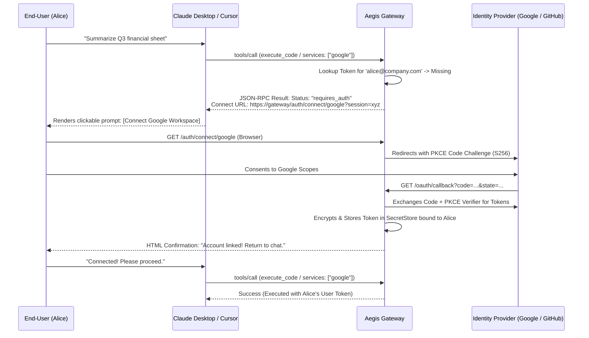

# Phase 21: Vendor-Agnostic Managed OAuth Connect Engine & RFC 9728 Discovery

> **Status**: Planned / Roadmap  
> **Target Standard**: RFC 9728 (OAuth Protected Resource Metadata), RFC 8414, OAuth 2.1 (PKCE), SOC 2 Type II  
> **Interface-First Contract**: `pub trait OAuthConnectEngine`, `pub struct VendorAgnosticOAuthRouter`  
> **File Line Constraint**: Strictly `<= 350 lines`

---

## 1. Enterprise Problem & Motivation

While advanced sandboxes isolate secrets during execution, end-users face an unacceptable operational barrier when trying to authorize AI agents:
1. **Developer-Only Configuration Burden**: Requiring end-users to create cloud developer projects, generate OAuth credentials, and manually manage refresh tokens is unusable for business users.
2. **Proprietary Vendor Lock-In**: Existing solutions (like proprietary hosted agent gateways) lock enterprises into proprietary clouds with closed-source credential escrow.
3. **Missing Interactive Auth Lifecycle in MCP**: When an agent attempts to access Google Drive or GitHub without an active user token, first-generation servers fail immediately with `401 Unauthorized` instead of providing an interactive authorization flow.

---

## 2. Core Architectural Design

Phase 21 establishes an open, vendor-agnostic **Managed OAuth Connect Engine** adhering to official MCP standards (RFC 9728 & OAuth 2.1 PKCE).



---

## 3. SOLID Trait Contract Specification

```rust
#[derive(Debug, Clone, serde::Serialize, serde::Deserialize)]
pub struct AuthProviderConfig {
    pub provider_name: String,
    pub auth_endpoint: String,
    pub token_endpoint: String,
    pub client_id: String,
    pub default_scopes: Vec<String>,
}

#[derive(Debug, Clone, serde::Serialize, serde::Deserialize)]
pub struct ConnectSession {
    pub session_id: String,
    pub caller_id: String,
    pub provider: String,
    pub code_verifier: String,
    pub state_nonce: String,
    pub created_at: chrono::DateTime<chrono::Utc>,
}

#[async_trait]
pub trait OAuthConnectEngine: Send + Sync {
    /// Initiate an agnostic OAuth connect flow with PKCE
    async fn initiate_connect(
        &self,
        caller_id: &str,
        provider: &str,
        redirect_uri: &str,
    ) -> AegisResult<(String, ConnectSession)>;

    /// Complete authorization callback and persist tokens
    async fn handle_callback(
        &self,
        code: &str,
        state: &str,
    ) -> AegisResult<String>;

    /// Check if caller has active authorized token for provider
    async fn has_active_token(&self, caller_id: &str, provider: &str) -> AegisResult<bool>;
}
```

---

## 4. Graduated Verification Plan
- [ ] **PKCE Challenge Tests**: S256 code challenge generation and verifier exchange.
- [ ] **State Nonce & CSRF Protection Tests**: Reject callbacks with mismatched or expired state.
- [ ] **Interactive Tool Response Tests**: Return standardized `requires_auth` payload when missing tokens.
