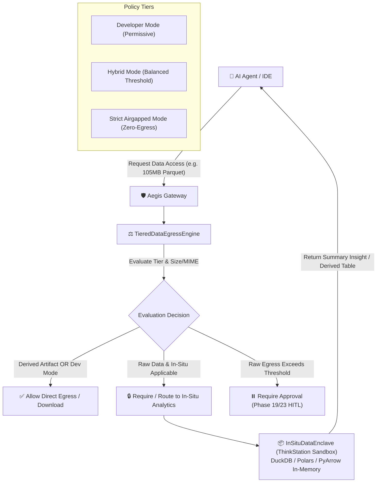

# Phase 22: Configurable Policy Tiers, Granular Data Egress & In-Situ Analytics Engine

> **Status**: Completed  
> **Target Standard**: NIST SP 800-207 (Zero Trust Architecture), GDPR/UU PDP Article 32, ISO 27001 A.8.12 (Data Leakage Prevention)  
> **Interface-First Contract**: `pub trait DataEgressPolicyEngine`, `pub trait InSituDataEnclave`  
> **File Line Constraint**: Strictly `<= 350 lines`

---

## 1. Enterprise Problem & Motivation

When AI agents interact with enterprise storage (e.g., Google Drive, AWS S3, internal database exports), binary "allow or block" permissions create severe operational friction:
1. **Unnecessary Data Exfiltration**: When an agent queries a 105MB Parquet/ZIP dataset for summary analytics, first-generation systems either block access completely or download the entire 105MB raw dataset to the employee's local device, violating compliance (GDPR, HIPAA, UU PDP).
2. **One-Size-Fits-All Rigidity**: Different enterprise environments require vastly different posture levels: developers need frictionless iteration, while financial/banking audit teams require zero-raw-data egress.
3. **Lack of In-Situ Analytics**: Agents lack a standardized way to execute high-performance analytical queries (DuckDB/Polars/PyArrow) directly inside the secure server enclave where the data lives.

---

## 2. Core Architectural Design

Phase 22 implements a declarative, vendor-agnostic **Dual-Path Data Egress & In-Situ Analytics Engine**:



---

## 3. SOLID Trait Contract Specification

```rust
#[derive(Debug, Clone, Copy, PartialEq, Eq, Serialize, Deserialize)]
pub enum PolicyTier {
    Developer,
    Hybrid,
    StrictAirgapped,
}

#[derive(Debug, Clone, Copy, PartialEq, Eq, Serialize, Deserialize)]
pub enum DataClassification {
    RawRestricted,
    DerivedArtifact,
    PublicResource,
}

#[derive(Debug, Clone, PartialEq, Eq, Serialize, Deserialize)]
pub enum DataEgressDecision {
    AllowDirectEgress,
    RequireInSituCompute {
        reason: String,
        alternatives: Vec<String>,
    },
    RequireApproval {
        ticket: ApprovalTicket,
        reason: String,
    },
    Deny {
        reason: String,
    },
}

#[async_trait]
pub trait DataEgressPolicyEngine: Send + Sync {
    async fn evaluate_egress(
        &self,
        resource_id: &str,
        resource_size_bytes: u64,
        mime_type: &str,
        classification: DataClassification,
        caller: &CallerContext,
    ) -> AegisResult<DataEgressDecision>;
}

#[async_trait]
pub trait InSituDataEnclave: Send + Sync {
    async fn execute_query(
        &self,
        query: &str,
        resource_path: &str,
        caller: &CallerContext,
    ) -> AegisResult<InSituExecutionResult>;
}
```

---

## 4. Graduated Verification & Acceptance Criteria

1. **Permissive Developer Tier**: Verifies that under `PolicyTier::Developer`, any resource is allowed for direct egress without suspension.
2. **Hybrid Balanced Tier**: Verifies that files under threshold (e.g. <= 10MB) or derived artifacts pass, while raw datasets (> 10MB) mandate In-Situ compute or HITL approval.
3. **Strict Air-Gapped Tier**: Verifies that raw datasets are strictly forbidden from leaving the enclave.
4. **In-Situ Execution Verification**: Validates that analytical operations produce clean aggregations without raw payload egress.
