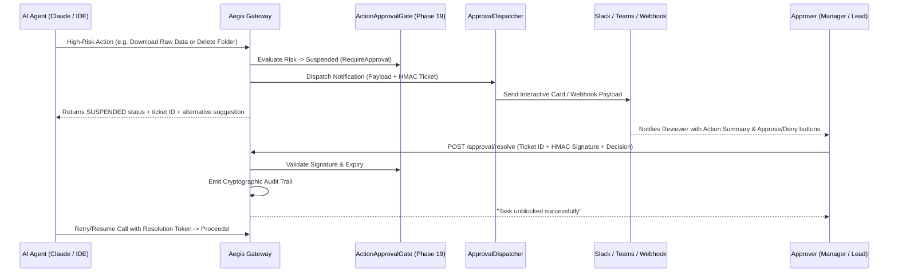

# Phase 23: Pluggable Multi-Channel Approval Dispatcher & Durable Resume Router

> **Status**: Completed  
> **Target Standard**: NIST SP 800-53 AC-2/AC-3 (Dual Authorization & HITL), SOC 2 Type II Non-Repudiation  
> **Interface-First Contract**: `pub trait ApprovalNotificationDispatcher`, `pub trait DurableResumeRouter`  
> **File Line Constraint**: Strictly `<= 350 lines`

---

## 1. Enterprise Problem & Motivation

While Phase 19 introduced the cryptographic token and suspended state primitives for Human-in-the-Loop gates, enterprises require flexible, vendor-agnostic notification routing and durable lifecycle completion:
1. **Diverse Communication Channels**: Different organizations use different operational channels (Slack, Microsoft Teams, Discord, internal webhooks, or in-band MCP interactive elicitation). A gateway must never hardcode a single webhook format or vendor.
2. **Context-Rich Actionable Previews**: Reviewers cannot approve actions blindly; payloads must include clear risk tiering, action summaries, parameters, and secure one-click review URLs.
3. **Stateless vs Durable Resume**: When an approver clicks "Approve" in Slack or an admin dashboard, the gateway must cryptographically verify HMAC integrity, unblock the paused task, and record a non-repudiation audit event.

---

## 2. Core Architectural Design

Phase 23 delivers a modular **Multi-Channel Approval Dispatcher & Durable Resume Router**:



---

## 3. SOLID Trait Contract Specification

```rust
#[derive(Debug, Clone, Serialize, Deserialize)]
pub enum ApprovalChannelTarget {
    GenericWebhook { url: String, secret_token: Option<String> },
    SlackWebhook { webhook_url: String, channel: Option<String> },
    TeamsWebhook { webhook_url: String },
    InBandMcp,
    ConsoleLog,
}

#[derive(Debug, Clone, Serialize, Deserialize)]
pub struct ApprovalNotificationPayload {
    pub ticket: ApprovalTicket,
    pub title: String,
    pub description: String,
    pub proposed_action: String,
    pub resource: String,
    pub resolve_base_url: String,
}

#[async_trait]
pub trait ApprovalNotificationDispatcher: Send + Sync {
    async fn dispatch(&self, payload: &ApprovalNotificationPayload) -> AegisResult<Vec<String>>;
}

#[async_trait]
pub trait DurableResumeRouter: Send + Sync {
    async fn resolve_and_resume(
        &self,
        ticket_id: &str,
        signature: &str,
        approved: bool,
        approver_id: &str,
    ) -> AegisResult<bool>;
}
```

---

## 4. Graduated Verification & Acceptance Criteria

1. **Multi-Target Dispatch**: Verifies dispatching notifications across multiple configured targets simultaneously (Slack, Webhook, Console).
2. **Cryptographic Validation on Resume**: Validates that valid HMAC signatures resume the workflow, while invalid or tampered signatures fail closed.
3. **Replay & Expiration Defense**: Verifies that expired or already-resolved tickets reject duplicate resolution attempts.
