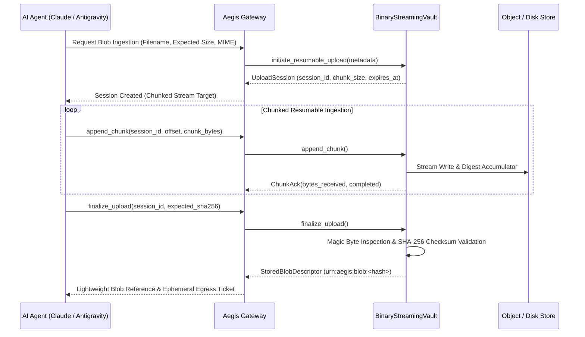

# Phase 24: Enterprise Multi-Modal Streaming & Chunked Binary Egress Vault

> **Status**: Completed  
> **Target Standard**: RFC 7233 (Range Requests), TUS Resumable Upload Protocol v1.0.0, SOC 2 Type II Confidentiality  
> **Interface-First Contract**: `pub trait BinaryStreamingVault`  
> **File Line Constraint**: Strictly `<= 350 lines`

---

## 1. Enterprise Problem & Motivation

Modern agentic workflows frequently generate and consume large binary assets:
1. **Large Data Exports & Parquet Files**: High-volume tabular exports (100MB+ zip/parquet files) cannot be serialized into JSON-RPC base64 strings without triggering client memory exhaustion and JSON parsing lockups.
2. **Multi-Modal Streams & Media**: Video clips, audio recordings, and geospatial datasets require out-of-band streaming channels with low latency and backpressure support.
3. **MIME Integrity & Egress Exfiltration Defense**: Malicious actors or compromised tools may disguise executables or sensitive databases under harmless extensions (e.g. `.png` or `.txt`). Deep magic-byte inspection is mandatory.

---

## 2. Core Architectural Design

Phase 24 establishes a dedicated **Zero-Buffer Streaming Binary Vault**:



---

## 3. SOLID Trait Contract Specification

```rust
#[derive(Debug, Clone, Serialize, Deserialize)]
pub struct BinaryBlobMetadata {
    pub tenant_id: String,
    pub file_name: String,
    pub declared_mime: String,
    pub expected_size: u64,
    pub sha256_checksum: Option<String>,
}

#[derive(Debug, Clone, Serialize, Deserialize)]
pub struct UploadSession {
    pub session_id: String,
    pub chunk_size: u32,
    pub expires_at_unix: u64,
}

#[derive(Debug, Clone, Serialize, Deserialize)]
pub struct ChunkAck {
    pub session_id: String,
    pub bytes_received: u64,
    pub total_received: u64,
    pub completed: bool,
}

#[derive(Debug, Clone, Serialize, Deserialize)]
pub struct StoredBlobDescriptor {
    pub blob_urn: String,
    pub storage_path: String,
    pub actual_mime: String,
    pub size_bytes: u64,
    pub sha256_checksum: String,
    pub created_at_unix: u64,
}

#[derive(Debug, Clone, Serialize, Deserialize)]
pub struct EphemeralEgressTicket {
    pub ticket_id: String,
    pub blob_urn: String,
    pub direct_download_url: String,
    pub expires_at_unix: u64,
    pub hmac_signature: String,
}

#[async_trait]
pub trait BinaryStreamingVault: Send + Sync {
    async fn initiate_resumable_upload(&self, metadata: &BinaryBlobMetadata) -> AegisResult<UploadSession>;
    async fn append_chunk(&self, session_id: &str, offset: u64, chunk: Vec<u8>) -> AegisResult<ChunkAck>;
    async fn finalize_upload(&self, session_id: &str, expected_sha256: Option<&str>) -> AegisResult<StoredBlobDescriptor>;
    async fn generate_ephemeral_egress_ticket(&self, blob_urn: &str, client_id: &str, ttl_secs: u64) -> AegisResult<EphemeralEgressTicket>;
    async fn inspect_blob_content(&self, blob_urn: &str) -> AegisResult<MimeInspectionResult>;
}
```

---

## 4. Graduated Verification & Acceptance Criteria

1. **Resumable Chunk Aggregation**: Verifies multi-chunk upload assembly with rolling SHA-256 verification.
2. **MIME & Magic Byte Verification**: Validates deep magic-byte inspection (detecting MIME spoofing).
3. **Signed Ephemeral Egress Ticket**: Validates HMAC-signed egress URLs with strictly enforced TTLs.
