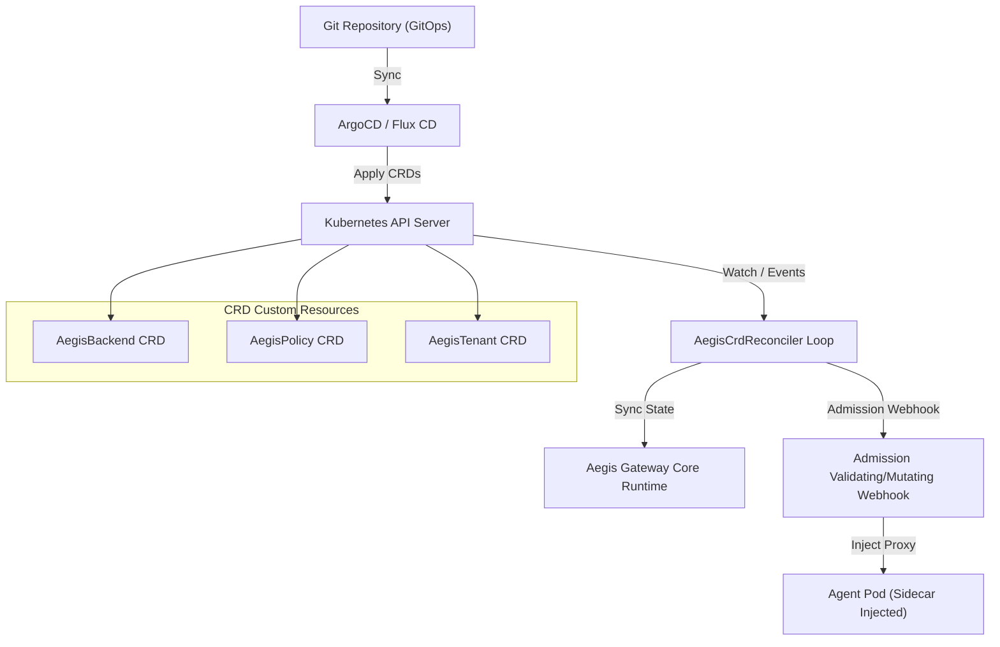

# Phase 25: Native Kubernetes Operator & Declarative GitOps CRD Engine

> **Status**: Completed  
> **Target Standard**: Kubernetes Operator Pattern, CNCF Cloud-Native Architecture, GitOps (ArgoCD/Flux)  
> **Interface-First Contract**: `pub trait AegisCrdReconciler`  
> **File Line Constraint**: Strictly `<= 350 lines`

---

## 1. Enterprise Problem & Motivation

Enterprise platform engineering teams do not manage security controls via ad-hoc command line interfaces or static local JSON files:
1. **Declarative Control Plane**: Upstream MCP tool backends, DLP policies, FinOps token limits, and approval routes must be managed as first-class Kubernetes Custom Resource Definitions (CRDs).
2. **GitOps Synchronization & Drift Detection**: When infrastructure engineers update policies in Git (e.g. promoting staging to production), the gateway reconciler must detect drift and apply updates without downtime.
3. **Admission Governance & Sidecar Injection**: Agent pods requesting MCP capabilities must be automatically inspected by a Validating/Mutating Admission Webhook, injecting secure proxy sidecars and rejecting unapproved backend configs.

---

## 2. Core Architectural Design

Phase 25 introduces the **Declarative Kubernetes CRD Reconciler & Admission Controller**:



---

## 3. SOLID Trait Contract Specification

```rust
#[derive(Debug, Clone, Serialize, Deserialize)]
pub struct AegisBackendCrd {
    pub name: String,
    pub namespace: String,
    pub transport: String,
    pub endpoint_or_cmd: String,
    pub replicas: u32,
    pub enabled: bool,
}

#[derive(Debug, Clone, Serialize, Deserialize)]
pub struct AegisPolicyCrd {
    pub name: String,
    pub namespace: String,
    pub tier: String, // dev, hybrid, strict
    pub rate_limit_rps: u32,
    pub circuit_breaker_threshold: u32,
    pub dlp_enabled: bool,
}

#[derive(Debug, Clone, Serialize, Deserialize)]
pub struct AegisTenantCrd {
    pub tenant_id: String,
    pub namespace: String,
    pub monthly_token_budget: u64,
    pub cost_center: String,
}

#[derive(Debug, Clone, Serialize, Deserialize)]
pub struct AdmissionDecision {
    pub allowed: bool,
    pub status_code: u16,
    pub reason: Option<String>,
}

#[derive(Debug, Clone, Serialize, Deserialize)]
pub struct ReconcileOutcome {
    pub resource_name: String,
    pub generation: u64,
    pub status: String,
    pub message: String,
}

#[async_trait]
pub trait AegisCrdReconciler: Send + Sync {
    async fn reconcile_backend(&self, spec: &AegisBackendCrd) -> AegisResult<ReconcileOutcome>;
    async fn reconcile_policy(&self, spec: &AegisPolicyCrd) -> AegisResult<ReconcileOutcome>;
    async fn reconcile_tenant(&self, spec: &AegisTenantCrd) -> AegisResult<ReconcileOutcome>;
    async fn validate_admission(&self, resource_kind: &str, raw_json: &serde_json::Value) -> AegisResult<AdmissionDecision>;
    async fn mutate_pod_spec(&self, pod_spec: &serde_json::Value) -> AegisResult<serde_json::Value>;
}
```

---

## 4. Graduated Verification & Acceptance Criteria

1. **Declarative Backend & Policy Reconciliation**: Verifies applying and reconciling `AegisBackend`, `AegisPolicy`, and `AegisTenant` CRDs into runtime state.
2. **Admission Validation**: Rejects invalid CRDs (e.g., negative token budgets or empty backend endpoints) before cluster admission.
3. **Automated Mutating Sidecar Injection**: Injects Aegis proxy sidecar containers and environment variables into agent pod specifications.
