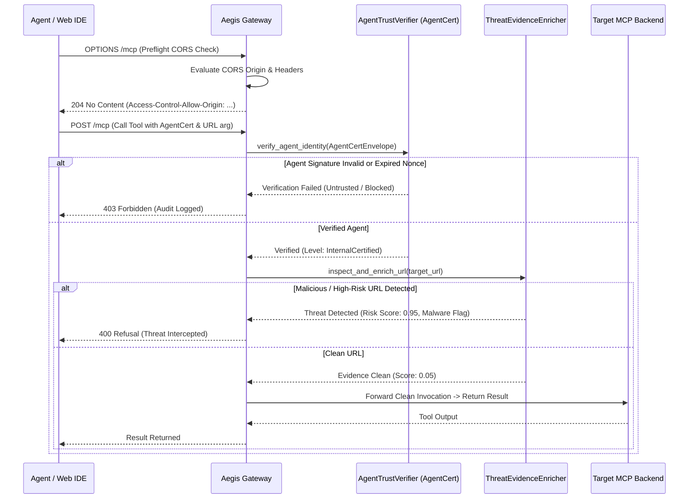

# Phase 26: Cryptographic Agent Identity (AgentCert) & Dynamic Threat Evidence Enrichment

> **Status**: Completed  
> **Target Standard**: NIST SP 800-207 Zero Trust Architecture, OWASP Top 10 for Agentic AI (LLM01 / LLM06)  
> **Interface-First Contract**: `pub trait AgentTrustVerifier`, `pub trait ThreatEvidenceEnricher`, `pub trait CorsPolicyEnforcer`  
> **File Line Constraint**: Strictly `<= 350 lines`

---

## 1. Enterprise Problem & Motivation

Community research on legacy MCP gateways revealed two critical vulnerabilities:
1. **Agent Impersonation & Unverified Prompts (`docker/mcp-gateway#585`)**:
   Anyone with network access to the gateway can invoke destructive tools pretending to be an authorized orchestrator. Agent certificates (AgentCert) with cryptographic nonces and asymmetric key signing ensure non-repudiation and proof-of-possession.
2. **Blind URL Execution & Data Exfiltration (`microsoft/mcp-gateway#109`)**:
   Tools accepting URL parameters (`fetch_web_page`, `download_file`, `webhook_post`) are prime vectors for SSRF, zero-day malware ingestion, and data exfiltration. The gateway must perform pre-flight threat evidence enrichment (domain reputation, malware flagging, and scheme sanitization) prior to tool dispatch.
3. **Browser Streamable HTTP CORS Misconfiguration (`docker/mcp-gateway#544`)**:
   Modern web-based agent IDEs and dashboards require granular, opt-in Cross-Origin Resource Sharing (CORS) handling without creating open wildcard security holes.

---

## 2. Core Architectural Design

Phase 26 implements **Agent Verification, Threat Enrichment & Pre-Flight CORS**:



---

## 3. SOLID Trait Contract Specification

```rust
#[derive(Debug, Clone, Serialize, Deserialize)]
pub struct AgentCertEnvelope {
    pub agent_id: String,
    pub public_key_pem: String,
    pub nonce: String,
    pub timestamp_unix: u64,
    pub signature_hex: String,
    pub declared_capabilities: Vec<String>,
}

#[derive(Debug, Clone, Serialize, Deserialize, PartialEq)]
pub enum AgentTrustLevel {
    Untrusted,
    Standard,
    VerifiedPartner,
    InternalCertified,
}

#[derive(Debug, Clone, Serialize, Deserialize)]
pub struct AgentVerificationOutcome {
    pub verified: bool,
    pub trust_level: AgentTrustLevel,
    pub tenant_id: String,
    pub failure_reason: Option<String>,
}

#[derive(Debug, Clone, Serialize, Deserialize)]
pub struct ThreatEvidenceReport {
    pub url: String,
    pub domain: String,
    pub risk_score: f32, // 0.0 (safe) to 1.0 (critical threat)
    pub malicious: bool,
    pub threat_categories: Vec<String>,
    pub source: String,
}

#[async_trait]
pub trait AgentTrustVerifier: Send + Sync {
    async fn verify_agent_identity(&self, cert: &AgentCertEnvelope) -> AegisResult<AgentVerificationOutcome>;
}

#[async_trait]
pub trait ThreatEvidenceEnricher: Send + Sync {
    async fn inspect_and_enrich_url(&self, target_url: &str) -> AegisResult<ThreatEvidenceReport>;
}

pub trait CorsPolicyEnforcer: Send + Sync {
    fn evaluate_cors_origin(&self, origin: Option<&str>, requested_headers: Option<&str>) -> CorsEvaluationResult;
}
```

---

## 4. Graduated Verification & Acceptance Criteria

1. **Cryptographic Agent Identity**: Verifies Ed25519/HMAC agent signature verification, rejecting expired nonces or forged signatures.
2. **Pre-Flight URL Threat Enrichment**: Intercepts high-risk URLs, internal IP probes (SSRF), and malicious domains with structured threat reports.
3. **CORS Policy Enforcement**: Validates browser preflight checks against explicit whitelists while refusing unauthorized cross-origin calls.
