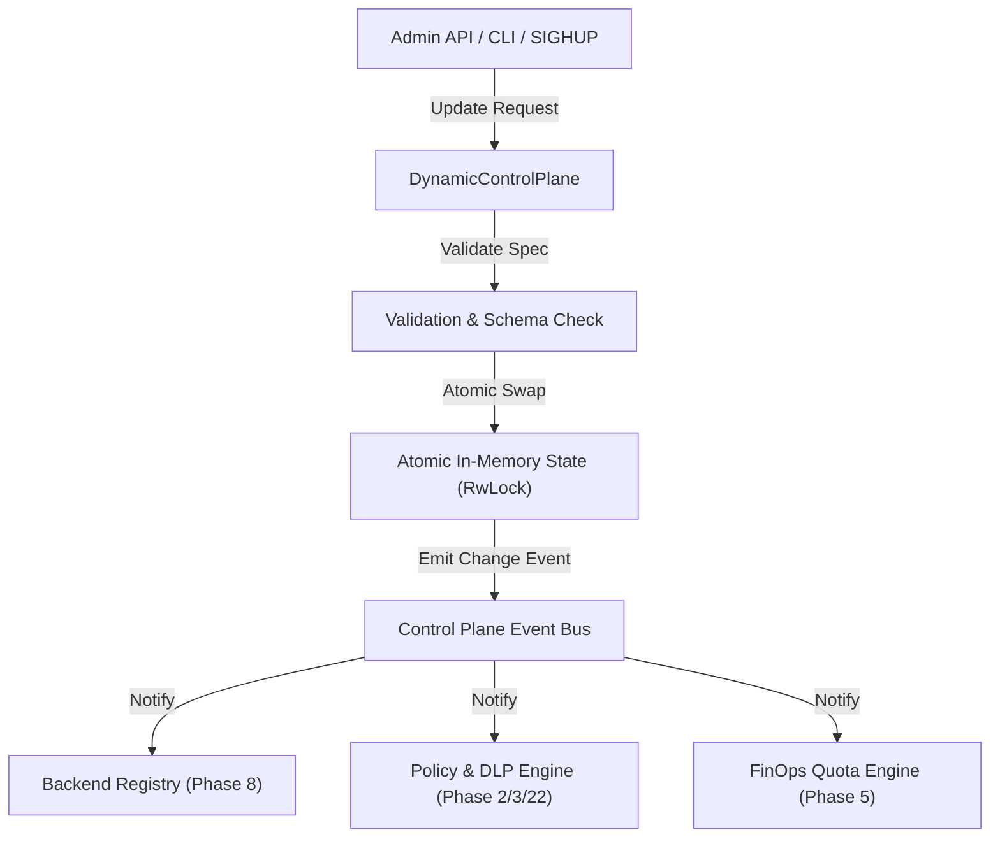

# Phase 27: Dynamic Runtime Control Plane & Zero-Downtime Hot-Reload Engine

> **Status**: Completed  
> **Target Standard**: Envoy Dynamic xDS Pattern, Kong Admin API & decK Sync, Zero-Downtime Hot-Reload  
> **Interface-First Contract**: `pub trait DynamicControlPlane`, `pub trait ConfigurationWatcher`  
> **File Line Constraint**: Strictly `<= 350 lines`

---

## 1. Enterprise Problem & Motivation

First-generation MCP gateways require hard process termination and restarts whenever configuration changes:
1. **Broken Agent Streams**: Active Streamable HTTP and SSE connections carrying multi-minute agent conversations drop violently when pods restart, resetting conversational context.
2. **Lost Inflight Tasks & HITL Approvals**: Suspended tasks awaiting human managerial approval (Phase 19 & 23) become orphaned and unrecoverable upon restart.
3. **High-Velocity Operational Changes**: In enterprise environments, tool registration, policy tier tuning (`dev` -> `hybrid` -> `strict`), token budget updates, and secret rotations happen dozens of times per day.

---

## 2. Core Architectural Design

Phase 27 introduces a **Dynamic Control Plane & Hot-Reload Engine** utilizing atomic in-memory state swapping:



---

## 3. SOLID Trait Contract Specification

```rust
#[derive(Debug, Clone, Serialize, Deserialize)]
pub struct RuntimeBackendUpdate {
    pub backend_name: String,
    pub transport: String,
    pub endpoint_or_cmd: String,
    pub enabled: bool,
}

#[derive(Debug, Clone, Serialize, Deserialize)]
pub struct RuntimePolicyUpdate {
    pub tenant_id: String,
    pub policy_tier: String, // dev, hybrid, strict
    pub rate_limit_rps: u32,
    pub dlp_enabled: bool,
}

#[derive(Debug, Clone, Serialize, Deserialize)]
pub struct DynamicControlPlaneStatus {
    pub active_backends_count: usize,
    pub active_policies_count: usize,
    pub last_reload_unix: u64,
    pub config_version: u64,
}

#[async_trait]
pub trait DynamicControlPlane: Send + Sync {
    async fn apply_backend_update(&self, update: &RuntimeBackendUpdate) -> AegisResult<u64>;
    async fn remove_backend(&self, backend_name: &str) -> AegisResult<bool>;
    async fn apply_policy_update(&self, update: &RuntimePolicyUpdate) -> AegisResult<u64>;
    async fn get_status(&self) -> AegisResult<DynamicControlPlaneStatus>;
}

#[async_trait]
pub trait ConfigurationWatcher: Send + Sync {
    async fn trigger_reload(&self) -> AegisResult<u64>;
    async fn watch_signal(&self) -> AegisResult<()>;
}
```

---

## 4. Graduated Verification & Acceptance Criteria

1. **Atomic In-Memory Swapping**: Verifies dynamic registration and teardown of backends without dropping existing connections.
2. **Policy Hot-Reload**: Verifies immediate switching of policy tiers (`dev` -> `strict`) affecting subsequent calls with 0ms downtime.
3. **Rollback & Fail-Closed Validation**: Verifies that invalid backend configurations are rejected atomically without corrupting live memory state.
