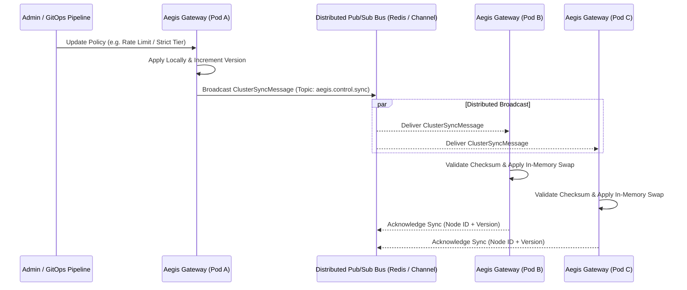

# Phase 28: Distributed Cluster State Sync & Pub/Sub Control Bus

> **Status**: Completed  
> **Target Standard**: Redis / NATS Pub/Sub Control Plane, Multi-Pod Kubernetes Synchronization, Anti-Split-Brain Checksumming  
> **Interface-First Contract**: `pub trait ClusterSyncEngine`  
> **File Line Constraint**: Strictly `<= 350 lines`

---

## 1. Enterprise Problem & Motivation

In enterprise high-availability deployments, Aegis Gateway runs as multiple replicated instances across Kubernetes pods or edge nodes:
1. **Multi-Pod Desynchronization**: When an administrator or CI/CD pipeline pushes a configuration change to Pod A via the Admin API, Pods B, C, and D remain on stale configurations if there is no cross-pod synchronization mechanism.
2. **Split-Brain & Configuration Drift**: Network partitions can cause divergent state across gateway nodes, causing inconsistent rate limits, stale token budgets, or bypassed security guardrails.
3. **Vendor-Agnostic Broadcast**: The synchronization bus must operate seamlessly across lightweight in-memory channels (for single-node / dev), Redis Pub/Sub, or NATS streaming without proprietary vendor lock-in.

---

## 2. Core Architectural Design

Phase 28 establishes a **Distributed Cluster Sync & Pub/Sub Control Bus**:



---

## 3. SOLID Trait Contract Specification

```rust
#[derive(Debug, Clone, Serialize, Deserialize)]
pub struct ClusterSyncMessage {
    pub message_id: String,
    pub source_node_id: String,
    pub event_type: String, // backend_updated, policy_updated, secret_rotated
    pub payload_json: String,
    pub version: u64,
    pub timestamp_unix: u64,
    pub checksum_sha256: String,
}

#[derive(Debug, Clone, Serialize, Deserialize)]
pub struct ClusterSyncReceipt {
    pub node_id: String,
    pub applied: bool,
    pub current_version: u64,
}

#[async_trait]
pub trait ClusterSyncEngine: Send + Sync {
    async fn broadcast_update(&self, event_type: &str, payload_json: &str) -> AegisResult<ClusterSyncMessage>;
    async fn ingest_peer_update(&self, message: &ClusterSyncMessage) -> AegisResult<ClusterSyncReceipt>;
    async fn get_cluster_nodes(&self) -> AegisResult<Vec<String>>;
}
```

---

## 4. Graduated Verification & Acceptance Criteria

1. **Multi-Node Broadcast & Sync**: Verifies that publishing a change on one node propagates and updates peer nodes without restarting.
2. **Tamper & Checksum Integrity**: Verifies that corrupted sync messages or mismatched checksums fail closed and are rejected.
3. **Replay & Idempotence**: Verifies that duplicate or stale version messages do not regress higher version state.
