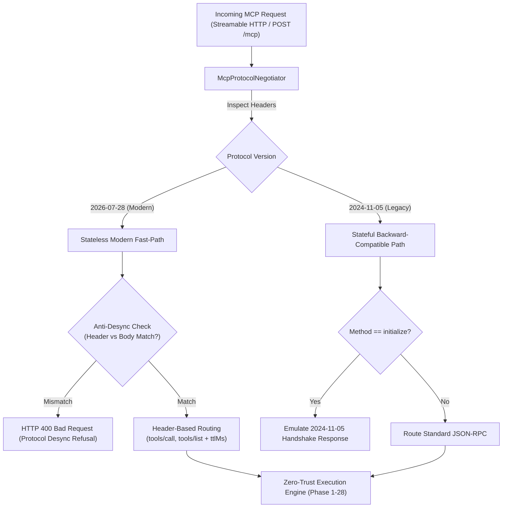

# Phase 29: Modern Stateless MCP 2026-07-28 Protocol & Dual-Stack Adaptive Negotiation

> **Status**: Completed  
> **Target Standard**: Official Model Context Protocol Specification `2026-07-28`, RFC 7230/7234 Caching, Anti-Desync Security  
> **Interface-First Contract**: `pub trait McpProtocolNegotiator`  
> **File Line Constraint**: Strictly `<= 350 lines`

---

## 1. Enterprise Problem & Motivation

On July 28, 2026, the Model Context Protocol underwent its most significant architectural evolution:
1. **From Stateful Sessions to Pure Stateless**: Legacy MCP (`2024-11-05`) mandated sticky transport sessions (`Mcp-Session-Id`) and an initial handshake (`initialize`), preventing efficient autoscaling behind round-robin Kubernetes load balancers and serverless workers.
2. **Header-Based Edge Routing**: MCP `2026-07-28` mandates `Mcp-Method` and `Mcp-Name` HTTP headers, enabling gateways and WAFs to route, rate-limit, and enforce ABAC without parsing heavy JSON-RPC bodies.
3. **Anti-Desync Protection**: Malicious actors can exploit differences between HTTP headers and JSON-RPC bodies to bypass security policies. Gateways must validate header-body consistency.
4. **Standardized Caching (`ttlMs`)**: Tool lists can now specify `ttlMs` cache lifetimes to dramatically cut down round-trip token waste.
5. **The Enterprise Dual-Stack Dilemma**: While Microsoft MCP Gateway made a breaking cut dropping all legacy clients, enterprise platforms cannot abruptly break existing IDEs. Gateways require **Dual-Stack Adaptive Negotiation** to support both `2026-07-28` and legacy `2024-11-05` seamlessly.

---

## 2. Core Architectural Design

Phase 29 establishes **Adaptive Dual-Stack Protocol Routing**:



---

## 3. SOLID Trait Contract Specification

```rust
#[derive(Debug, Clone, PartialEq, Eq, Serialize, Deserialize)]
pub enum McpProtocolVersion {
    Legacy2024_11_05,
    Modern2026_07_28,
    Unknown(String),
}

#[derive(Debug, Clone, Serialize, Deserialize)]
pub struct HeaderRoutingMetadata {
    pub protocol_version: McpProtocolVersion,
    pub method: Option<String>,
    pub name: Option<String>,
}

#[derive(Debug, Clone, Serialize, Deserialize, PartialEq, Eq)]
pub struct AntiDesyncValidationResult {
    pub is_valid: bool,
    pub reason: Option<String>,
}

#[derive(Debug, Clone, Serialize, Deserialize)]
pub struct NegotiatedMcpContext {
    pub version: McpProtocolVersion,
    pub is_stateless: bool,
    pub emit_cache_ttl_ms: Option<u64>,
}

#[async_trait]
pub trait McpProtocolNegotiator: Send + Sync {
    fn detect_protocol_version(&self, header_value: Option<&str>) -> McpProtocolVersion;
    fn validate_anti_desync(
        &self,
        headers: &HeaderRoutingMetadata,
        body_method: &str,
        body_tool_name: Option<&str>,
    ) -> AntiDesyncValidationResult;
    fn negotiate_context(&self, version: &McpProtocolVersion) -> NegotiatedMcpContext;
}
```

---

## 4. Graduated Verification & Acceptance Criteria

1. **Modern Stateless Request Routing**: Verifies direct invocation of tools with `Mcp-Protocol-Version: 2026-07-28` without prior `initialize` handshake.
2. **Anti-Desync Security Gate**: Verifies that requests where `Mcp-Method` or `Mcp-Name` disagree with the JSON-RPC body fail closed immediately with HTTP 400.
3. **Dual-Stack Backward Compatibility**: Verifies that legacy `2024-11-05` clients sending `initialize` handshakes continue to work seamlessly.
4. **Cache Metadata Injection (`ttlMs`)**: Verifies that modern `tools/list` responses contain standardized `ttlMs` caching parameters.
