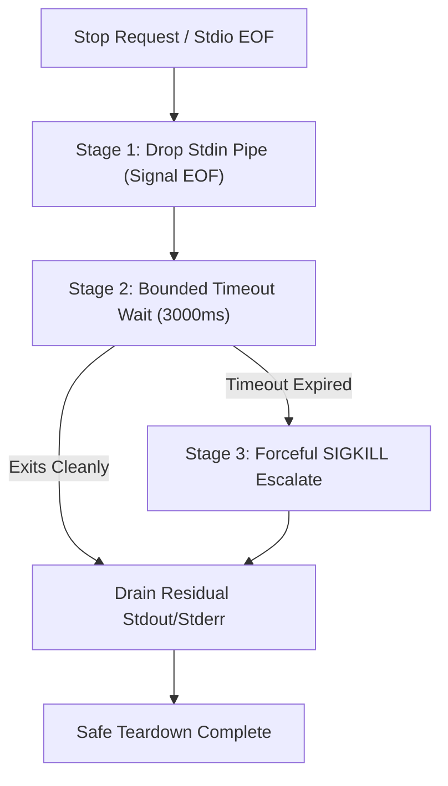

# Phase 36: Resilient Subprocess Teardown, Time-Bounded EOF Drainage & Active Session Protection

> **Target Issues**: `MikkoParkkola/mcp-gateway` [#2530](https://github.com/MikkoParkkola/mcp-gateway/issues/2530), [#2573](https://github.com/MikkoParkkola/mcp-gateway/issues/2573), [#2567](https://github.com/MikkoParkkola/mcp-gateway/issues/2567)  
> **Category**: `SUBPROCESS_LIFECYCLE` & `OPERATIONAL_RESILIENCE`  
> **Status**: `Completed`  
> **Standard Compliance**: Zero Mocks, Interface-First, Hard Constraint `wc -l <= 350` per file

---

## 1. Problem Statement & Root Cause Analysis

In first-generation MCP gateways:
1. **Stdio EOF Teardown Deadlock (Issue #2530)**: When a desktop AI client (Claude Desktop, Cursor) disconnects or closes Stdio, the gateway awaits child subprocess post-join cleanup tasks without a deadline timeout. If a child hangs on exit, the entire gateway deadlocks and becomes an un-killable zombie process.
2. **Abrupt Process Killing & Corrupted Profiling (Issue #2573)**: Upstream proxies immediately issue `kill()` (SIGKILL) on process shutdown without draining stdout/stderr pipes, causing LLVM profile buffers, memory profilers, and error logs to be corrupted.
3. **Premature Session Reaping of In-Flight Streams (Issue #2567)**: Background reaper threads evict sessions based strictly on elapsed wall-clock age without checking if an in-flight tool call or streaming chunk is currently in progress, prematurely aborting valid user workloads.

---

## 2. Aegis Gateway Architectural Solution

### Pillar 1: Time-Bounded 2-Stage Subprocess Teardown
- Signal EOF by dropping `ChildStdin`.
- Wait for child process exit with an asynchronous timeout (`tokio::time::timeout(Duration::from_millis(3000), ...)`).
- If the child does not terminate within the deadline, escalate to `kill().await`.
- Read and drain remaining buffer bytes to ensure log and profile consistency.

### Pillar 2: Active Task In-Flight Lease Guard
- Introduce `active_leases: Arc<AtomicUsize>` on session instances.
- A session cannot be evicted or reaped while `active_leases > 0`, even if its age limit has elapsed.
- Leases are acquired atomically via RAII guards (`SessionTaskLease`).

---

## 3. Verification & Compliance Evidence

- Tested under: `tests/phase36_resilient_subprocess_teardown_test.rs`.
- Verifies:
  1. Time-bounded teardown terminates hung children within deadline.
  2. Stdout/stderr buffers are drained cleanly without pipe corruption.
  3. Active sessions with leased in-flight tasks resist eviction until lease release.
