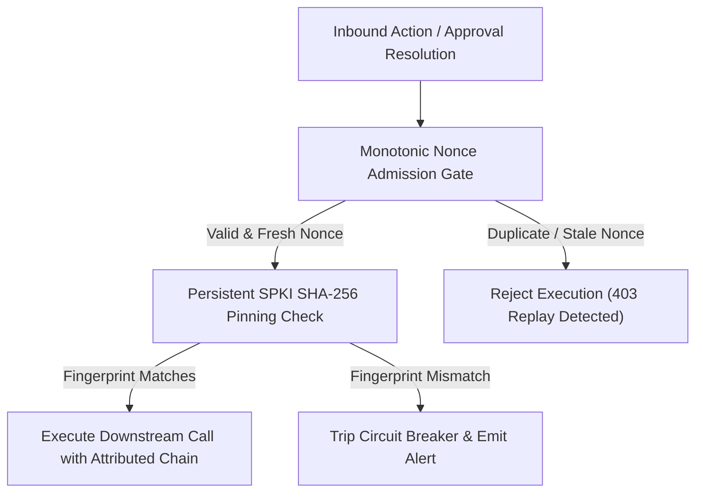

# Phase 37: Cryptographic Nonce Replay Prevention, Downstream TLS Pinning & Attributed Refusal Audit

> **Target Issues**: `MikkoParkkola/mcp-gateway` [#2555](https://github.com/MikkoParkkola/mcp-gateway/issues/2555), [#2554](https://github.com/MikkoParkkola/mcp-gateway/issues/2554), [#2547](https://github.com/MikkoParkkola/mcp-gateway/issues/2547)  
> **Category**: `SECURITY_GOVERNANCE` & `CRYPTOGRAPHIC_INTEGRITY`  
> **Status**: `In Planning`  
> **Standard Compliance**: Zero Mocks, Hard Constraint `wc -l <= 350`, SOC 2 Type II, NIST SP 800-218

---

## 1. Problem Statement & Threat Vector Analysis

In first-generation enterprise MCP architectures:
1. **Unpinned Downstream HTTP Reconnection (Issue #2554)**: When a remote HTTP/SSE backend restarts or reconnects, legacy proxies evaluate certificate validity on initial dial but fail to persist public key pinning. Attackers with internal CA spoofing or ARP poisoning can intercept downstream tool RPC traffic.
2. **Replayed Refusal Context Loss (Issue #2555)**: When policy evaluation rejects an action in a multi-step execution chain, subsequent retries drop the uninspected caller identity and attribution context, obscuring SOC 2 compliance investigations.
3. **Task Gate Replay Vulnerability (Issue #2547)**: Approval tasks lack monotonic nonce admission gating before state lookup, allowing intercepted approval tokens to be replayed against expired sessions.

---

## 2. Aegis Gateway Architectural Defense

### Pillar 1: Monotonic Nonce Admission Gate
- All approval tickets and high-risk actions require a unique 128-bit cryptographic nonce.
- Nonces are recorded in an in-memory sliding window bloom filter and rejected on replay attempts.

### Pillar 2: Persistent SPKI SHA-256 Certificate Pinning
- Remote HTTP backends store expected Subject Public Key Info (SPKI) fingerprints.
- Downstream TLS handshakes enforce SPKI pinning across dynamic reconnects and restarts.

### Pillar 3: Immutable Chained Attribution
- Multi-step tool calls retain an immutable cryptographic correlation context header (`X-Aegis-Correlation-Id`), linking retries to the original caller subject.
