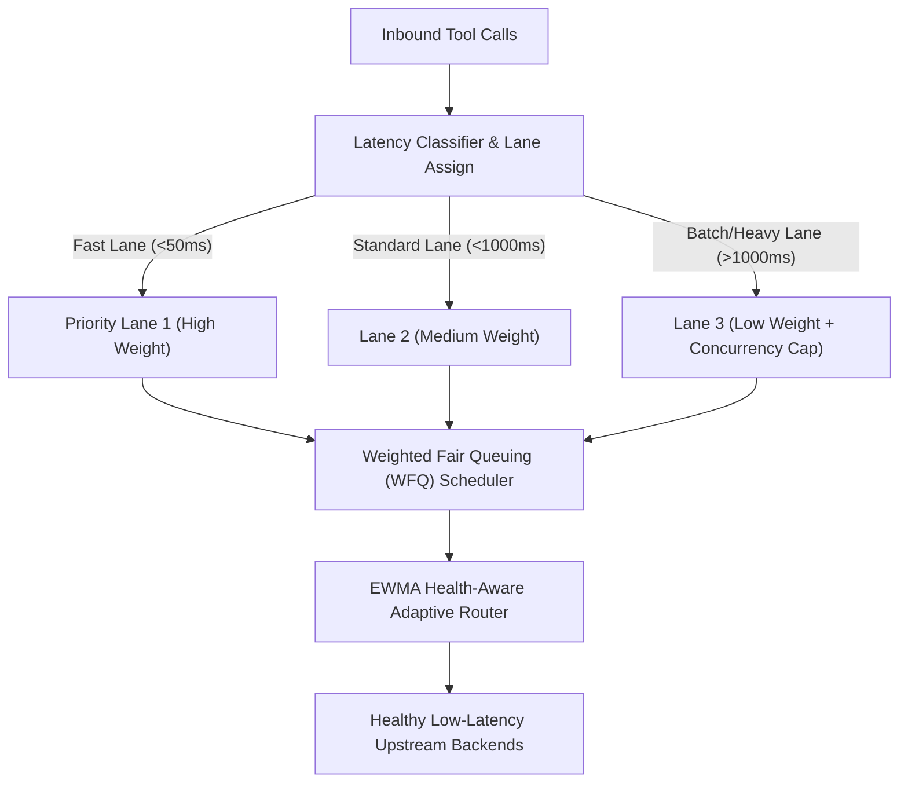

# Phase 38: Head-of-Line (HOL) Blocker Guard, Health-Aware Adaptive Routing & Weighted Fair Queuing

> **Target Issues**: `docker/mcp-gateway` [#558](https://github.com/docker/mcp-gateway/issues/558), `MikkoParkkola/mcp-gateway` [#2641](https://github.com/MikkoParkkola/mcp-gateway/issues/2641), `microsoft/mcp-gateway` [#105](https://github.com/microsoft/mcp-gateway/issues/105)  
> **Category**: `OPERATIONAL_HA` & `PERFORMANCE_OPTIMIZATION`  
> **Status**: `In Planning`  
> **Standard Compliance**: Zero Mocks, Hard Constraint `wc -l <= 350`, High-Throughput Wire Dispatch

---

## 1. Problem Statement & Bottleneck Analysis

In multi-tenant AI agent deployments:
1. **Head-of-Line (HOL) Blocking (Docker #558)**: When an agent issues a slow, long-running tool invocation (e.g. 45-second headless browser scrape or 30-second heavy analytical DB query), requests share a single FIFO queue, completely starving sub-millisecond tools (e.g. 0.2ms internal wiki or weather cache) across all other active agents.
2. **Static Unaware Routing (MikkoParkkola #2641)**: Gateways route requests round-robin or randomly without considering backend health degradations or response latency drift.
3. **Silent Schema & Performance Drift (Microsoft #105)**: Backend MCP servers introduce modified input schemas or degraded execution times without a baseline to detect anomalies.

---

## 2. Aegis Gateway Architectural Solution

### Pillar 1: Head-of-Line (HOL) Guard & Weighted Fair Queuing
- Requests are classified into three lanes: Fast (<50ms), Standard, and Long-Running/Batch (>1000ms).
- Batch lane is concurrency-capped (e.g., maximum 4 concurrent calls per tenant) to prevent resource starvation.

### Pillar 2: Adaptive EWMA Health & Latency Ranking
- Maintains an Exponentially Weighted Moving Average (EWMA) of backend response times and error rates.
- Automatically favors lower-latency nodes for redundant backends.

### Pillar 3: Schema & Performance Drift Baseline
- Compares response latency against baseline percentiles (P50, P90, P99).
- Emits telemetry alerts when schema definitions drift from verified catalogs.
